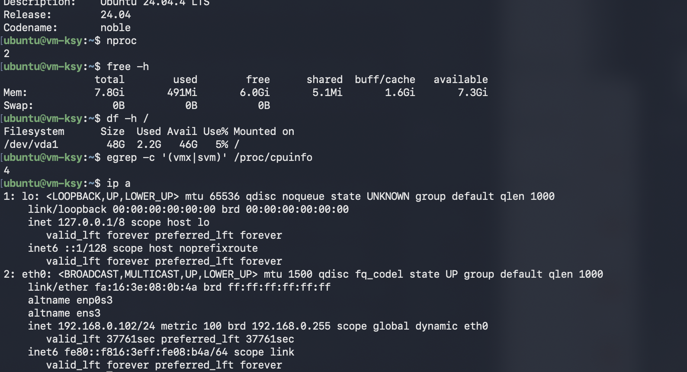

# 3회차 예습

# Part A — 필수

## 1. 인스턴스 생성 6단계 요약표

Horizon이나 CLI에서 인스턴스 생성 요청을 보내면 다음 흐름을 거친다.

| 단계 | 구간 | 주요 구성 요소 | 하는 일 | 대표 상태/특징 |
|---:|---|---|---|---|
| 1 | 인증 | Horizon/CLI → Keystone | 사용자와 프로젝트 권한을 확인하고 토큰 발급 | 수 초 미만 |
| 2 | 접수 | `nova-api`, DB | 요청 형식을 확인하고 인스턴스 레코드 생성 | `BUILD` |
| 3 | 배치 결정 | Scheduler, Placement | 자원 조건을 비교해 실행할 컴퓨트 노드 선택 | Filter → Weigh |
| 4 | 작업 수신 | RabbitMQ, `nova-compute` | 선택된 노드에 비동기 작업 전달 | `cast` 방식 |
| 5 | 준비물 수집 | Glance, Neutron, Cinder | 이미지, 포트·IP, 필요 시 볼륨 준비 | 주로 수십 초 |
| 6 | 기동 | `nova-compute`, libvirt, QEMU | VM을 정의하고 프로세스를 실행 | `ACTIVE` |

```text
인증 → 접수 → 배치 결정 → 작업 수신 → 준비물 수집 → 기동
                                              BUILD → ACTIVE
```

## 2. 단계별 상세

### 1단계 — 인증

모든 요청의 첫 관문은 **Keystone**이다. 사용자는 ID와 비밀번호 또는 저장된 자격 증명으로 토큰을 발급받고, 이후 API 요청에 `X-Auth-Token` 헤더로 토큰을 첨부한다. 이 토큰을 바탕으로 시스템은 다음을 판단한다.

- 요청한 사용자가 누구인지
- 어느 프로젝트에 속하는지
- 어떤 권한을 가졌는지

### 2단계 — 접수

`nova-api`는 토큰과 요청 형식을 검증한다. 사용할 이미지, 인스턴스 크기(flavor), 네트워크 등의 정보가 유효하면 DB에 인스턴스 레코드를 만들고 상태를 `BUILD`로 기록한다.

이 시점부터 대시보드에는 인스턴스가 보이지만, 실제 VM 프로세스는 아직 만들어지지 않았다.

> **핵심:** 관리 화면의 레코드와 실제 자원의 존재 시점은 다를 수 있다. 이 차이를 이해하는 것이 클라우드 장애 분석의 출발점이다.

### 3단계 — 배치 결정

Scheduler는 VM을 어느 컴퓨트 노드에 배치할지 결정한다.

1. **Placement 조회:** 각 노드의 남은 vCPU, 메모리, 디스크 등 확인
2. **Filter:** 요구 조건을 만족하지 못하는 노드 제외
3. **Weigh:** 남은 후보에 점수를 매겨 최종 노드 선택

all-in-one 환경은 노드가 한 대뿐이어도 같은 경로를 거친다. 모든 노드가 Filter에서 탈락하면 `No valid host was found` 오류가 발생할 수 있다.

### 4단계 — 작업 수신

선택된 노드의 `nova-compute`에 RabbitMQ를 통해 작업이 전달된다. 이는 요청을 보내고 완료를 기다리지 않는 비동기 `cast` 방식이다. 따라서 API 서버는 VM 기동이 끝나기 전에도 다음 요청을 처리할 수 있다.

### 5단계 — 준비물 수집

`nova-compute`가 VM 실행에 필요한 자원을 준비한다.

- **Glance:** 부팅 이미지 제공. 처음 사용하는 이미지는 내려받는 시간이 필요하며, 캐시된 뒤에는 더 빨라질 수 있다.
- **Neutron:** 가상 NIC에 해당하는 포트를 만들고 MAC 주소와 IP를 할당한다.
- **Cinder:** 블록 스토리지 볼륨을 사용하는 경우에만 준비하고 연결한다.

네트워크 전송과 실제 자원 준비가 필요하므로 시간이 비교적 오래 걸리는 구간이다.

### 6단계 — 기동

준비가 끝나면 `nova-compute`가 libvirt에 VM 정의(XML)를 전달하고 QEMU 프로세스를 실행한다. 정상적으로 기동되면 인스턴스 상태가 `BUILD`에서 `ACTIVE`로 바뀐다.

단, `ACTIVE`는 하이퍼바이저 관점에서 VM이 실행 중이라는 뜻이다. 게스트 OS 부팅과 `sshd` 준비가 끝나기 전에는 잠시 SSH 접속이 되지 않을 수 있다.

## 3. 핵심 관점

### 빠른 구간과 느린 구간

- **1~4단계:** 인증과 결정 중심이므로 보통 수 초 이내
- **5~6단계:** 이미지·네트워크·스토리지 준비와 VM 실행이 필요하므로 수십 초 이상 걸릴 수 있음

인스턴스 생성이 오래 걸린다면 우선 5~6단계와 게스트 OS 부팅 구간을 의심한다.

### 화면 상태와 실제 상태는 다를 수 있다

- 2단계에서 DB 레코드가 생성되면 화면에 인스턴스가 나타난다.
- 6단계가 완료돼야 실제 VM 프로세스가 실행된다.
- `ACTIVE` 이후에도 OS와 SSH 서비스가 준비될 때까지 시간이 더 필요할 수 있다.

### request-id는 서비스 간 추적의 연결고리다

각 요청에는 일반적으로 `req-`로 시작하는 request-id가 부여된다. 같은 ID가 여러 OpenStack 서비스 로그에 기록되므로, 하나의 요청이 어느 단계에서 실패했는지 추적할 수 있다.

### 구현이 달라도 클라우드의 본질은 비슷하다

가비아와 OpenStack의 내부 구현이 완전히 같지는 않더라도, 인증·요청 접수·배치·자원 준비·기동이라는 전체 흐름은 여러 클라우드 플랫폼에 공통으로 나타난다.

## 4. SSH 원리

SSH(Secure Shell)는 원격 서버의 터미널을 암호화된 통신으로 사용할 수 있게 하는 프로토콜이며 기본 포트는 22번이다. 클라우드 VM은 보통 비밀번호 대신 **키페어 인증**을 사용한다.

| 구분 | 비유 | 보관 위치 | 주의사항 |
|---|---|---|---|
| 공개키(public key) | 자물쇠 | 서버의 `~/.ssh/authorized_keys` | 서버에 등록해도 됨 |
| 개인키(private key) | 열쇠 | 사용자 컴퓨터의 `.pem` 파일 등 | 절대 공유하거나 공개 저장소에 올리지 않음 |

접속할 때 서버는 클라이언트가 등록된 공개키에 대응하는 개인키를 가졌는지 확인한다. 개인키 자체는 네트워크로 전송되지 않는다.

> **보안 주의:** 개인키가 유출되면 해당 키로 접근 가능한 서버가 침해될 수 있다. 메신저 단체방, 공개 저장소, 공유 문서에 올리지 않는다.

VM 최초 부팅 때 공개키가 서버 안에 배치되는 과정은 Part B의 cloud-init과 메타데이터 서비스에서 다룬다.



## 5. 에러별 의미와 조치

| 메시지 | 의미 | 우선 확인할 것 | 조치 |
|---|---|---|---|
| `Permission denied (publickey)` | 서버에는 도달했지만 공개키 인증 실패 | 개인키 경로, 계정명, 서버에 등록된 공개키 | 올바른 `-i` 경로와 계정명을 사용하고 키 배포 상태 확인 |
| `WARNING: UNPROTECTED PRIVATE KEY FILE!` | 개인키 파일 권한이 너무 넓음 | 키 파일 권한 | macOS/Linux에서 `chmod 600 <키파일>` 실행 |
| `Connection timed out` | 정해진 시간 안에 서버 응답을 받지 못함 | IP 오타, 보안 그룹·방화벽 22번, 라우팅, 로컬 네트워크 | 주소와 네트워크 경로를 순서대로 확인 |
| `Connection refused` | 서버까지 도달했지만 해당 포트에서 연결 거부 | VM 부팅 상태, `sshd` 실행 여부, SSH 포트 | 부팅 직후면 잠시 기다리고 서버 측 SSH 서비스 확인 |
| `No route to host` | 목적지까지의 네트워크 경로를 찾지 못함 | 라우팅, VPN, 인터페이스, 방화벽 | 로컬·클라우드 네트워크 경로 확인 |
| `REMOTE HOST IDENTIFICATION HAS CHANGED!` | 저장된 지문과 현재 서버 지문이 다름 | 서버 재생성/IP 재사용 여부, 중간자 공격 가능성 | 서버 교체 사실과 새 지문을 먼저 확인한 뒤 기존 항목 삭제 |

### `timed out`과 `refused` 구분

- **Timed out:** 서버 또는 22번 포트까지 가는 길에서 응답이 없다. IP, 라우팅, 방화벽, 보안 그룹을 우선 본다.
- **Refused:** 목적지에는 도착했지만 해당 포트가 연결을 받지 않는다. 서버 부팅 상태와 `sshd`를 우선 본다.

## 6. 예습 질문과 정답

### Q1. 6단계 중 시간이 실제로 오래 걸리는 구간은 어디이며, 왜 그런가?

**정답:** 주로 5단계 준비물 수집과 6단계 기동이다. 이미지 다운로드, 네트워크 포트와 IP 준비, 필요 시 볼륨 연결, QEMU 프로세스 생성처럼 실제 자원과 입출력을 다루기 때문이다. 이후 게스트 OS 부팅에도 추가 시간이 든다.

### Q2. 인스턴스가 대시보드에 보이는 시점과 실제로 존재하는 시점은 왜 다른가?

**정답:** 2단계에서 `nova-api`가 DB 레코드를 생성하면 대시보드에 보이지만, 실제 VM 프로세스는 6단계에서 libvirt와 QEMU가 기동한 뒤 존재한다. 즉 2단계와 6단계 사이에 관리 상태와 실제 상태의 간극이 있다.

### Q3. 공개키와 개인키 중 서버에 저장되는 것은 무엇이며, 절대 전달하면 안 되는 것은 무엇인가?

**정답:** 공개키가 서버의 `authorized_keys`에 저장된다. 개인키는 사용자만 보관해야 하며 타인에게 전달하거나 공개된 장소에 올리면 안 된다.

### Q4. `Connection timed out`과 `Connection refused`는 각각 무엇을 뜻하는가?

**정답:** `timed out`은 네트워크 경로나 방화벽 등으로 응답을 받지 못했다는 신호다. `refused`는 서버에는 도달했지만 22번 포트에서 서비스를 받지 못했다는 신호다.

---

# Part B — 심화

## 9. 상태 전이: `BUILD`에서 `ACTIVE`까지

인스턴스 생성 중 상태는 다음과 같이 움직인다.

```text
BUILD (scheduling) → BUILD (networking) → BUILD (spawning) → ACTIVE
                                                          ↘ ERROR
```

| 진행 상태 | 대응 구간 | 의미 |
|---|---:|---|
| `BUILD (scheduling)` | 3단계 | 실행할 컴퓨트 노드를 찾는 중 |
| `BUILD (networking)` | 5단계 | Neutron 포트와 네트워크를 준비하는 중 |
| `BUILD (spawning)` | 6단계 | libvirt/QEMU로 VM을 기동하는 중 |
| `ACTIVE` | 6단계 완료 | 하이퍼바이저 관점에서 VM이 실행 중 |
| `ERROR` | 모든 단계 | 특정 작업이 실패했으며 fault 정보 확인 필요 |

### `No valid host was found`

이 메시지는 3단계 Scheduler가 조건에 맞는 컴퓨트 노드를 찾지 못했다는 뜻이다. 흔한 원인은 다음과 같다.

- 가용 메모리 부족
- 디스크 또는 vCPU 부족
- flavor 요구 조건 불일치
- 가용 영역·호스트 집합 등 배치 조건 불일치
- Placement 자원 정보 불일치

따라서 단순히 “서버가 고장 났다”고 판단하기보다 Scheduler와 Placement의 자원·조건부터 확인한다.

## 10. cloud-init과 메타데이터 서비스

### cloud-init의 역할

cloud-init은 클라우드용 Linux 이미지에 포함된 초기화 도구다. VM의 첫 부팅 과정에서 다음과 같은 작업을 수행한다.

- SSH 공개키를 사용자의 `~/.ssh/authorized_keys`에 배치
- 호스트명 설정
- 파티션과 파일시스템 확장
- 사용자 데이터(user-data) 스크립트 실행

### 메타데이터는 어디에서 가져오는가?

VM은 일반적으로 링크-로컬 주소 `http://169.254.169.254`를 통해 자신의 메타데이터를 조회한다.

```text
VM 첫 부팅
  → cloud-init 실행
  → 169.254.169.254에서 메타데이터 조회
  → 공개키·호스트명·user-data 수신
  → 초기 설정과 authorized_keys 배치
  → SSH 접속 가능
```

`169.254.0.0/16`은 외부로 라우팅되지 않는 링크-로컬 대역이다. 클라우드의 네트워크 계층이 요청을 메타데이터 서비스로 연결한다. OpenStack에서는 Neutron metadata agent가 이 과정에 관여하며, 배포 방식에 따라 관련 컨테이너나 프로세스를 확인할 수 있다.

### `ACTIVE`인데 SSH가 안 될 수 있는 이유

`ACTIVE`는 VM 프로세스가 실행 중이라는 뜻일 뿐, cloud-init이 성공했다는 뜻은 아니다. 메타데이터 접근이 실패하면 공개키가 `authorized_keys`에 들어가지 않아 VM은 실행 중인데도 키 인증이 실패할 수 있다.

진단 가설은 다음과 같다.

1. VM 내부에서 `169.254.169.254`에 접근하지 못한다.
2. Neutron metadata agent 또는 관련 네트워크 경로에 문제가 있다.
3. cloud-init이 실패했거나 아직 실행 중이다.
4. 공개키 또는 접속 계정이 잘못 지정됐다.

VM 콘솔 접근이 가능하다면 다음 정보가 도움이 된다.

```bash
cloud-init status --long
sudo journalctl -u cloud-init
sudo tail -n 100 /var/log/cloud-init.log
```

## 11. `known_hosts`와 서버 지문

사용자 인증용 키와 별개로 SSH 서버도 **호스트 키**를 가진다. 첫 접속 때 클라이언트는 서버 호스트 키의 지문을 확인하고, 사용자가 승인하면 `~/.ssh/known_hosts`에 저장한다.

다음 접속부터는 저장한 지문과 서버가 제시한 지문을 비교한다. 값이 바뀌면 SSH는 중간자 공격 가능성을 알리기 위해 다음 경고를 표시한다.

```text
REMOTE HOST IDENTIFICATION HAS CHANGED!
```

스터디 환경에서는 VM을 삭제한 뒤 같은 IP를 새 VM에 할당했을 때도 이 경고가 발생할 수 있다. 새 VM은 이전 VM과 다른 호스트 키를 갖기 때문이다.

서버가 실제로 재생성됐고 새 지문이 신뢰할 수 있음을 관리자에게 확인한 뒤, 기존 기록을 삭제한다.

```bash
ssh-keygen -R <공인IP>
```

그다음 다시 접속해 새 지문을 확인하고 저장한다. 서버 교체 여부를 확인하지 않은 채 경고를 무시하거나 기존 지문을 삭제해서는 안 된다.

## 12. 심화 질문과 정답

### Q1. `No valid host was found`는 어느 단계의 오류이며 무엇을 확인해야 하는가?

**정답:** 3단계 배치 결정에서 Scheduler가 유효한 호스트를 찾지 못한 오류다. 컴퓨트 노드의 vCPU·메모리·디스크 여유, flavor 요구 조건, 가용 영역과 배치 정책, Placement의 자원 정보를 확인한다.

### Q2. `ACTIVE` 상태인데 SSH가 안 된다면 cloud-init과 메타데이터 관점에서 어떤 가설을 세울 수 있는가?

**정답:** VM 프로세스는 기동됐지만 cloud-init이 메타데이터 서비스에 접근하지 못했거나 초기화에 실패해 공개키를 `authorized_keys`에 배치하지 못했을 수 있다. metadata agent, `169.254.169.254` 경로, cloud-init 상태와 로그를 확인한다.

### Q3. VM 재발급 후 `REMOTE HOST IDENTIFICATION HAS CHANGED!`가 뜨는 이유와 해결 방법은?

**정답:** 같은 IP에 새 VM이 할당돼 호스트 키가 달라졌기 때문이다. 먼저 VM 교체 사실과 새 지문을 안전한 경로로 확인한 후 `ssh-keygen -R <공인IP>`로 이전 지문을 지우고 재접속한다.

### Q4. `ACTIVE` 직후 `Connection refused`가 발생한다면 가장 먼저 세울 가설은?

**정답:** VM 프로세스는 실행됐지만 게스트 OS 부팅이나 `sshd` 시작이 아직 끝나지 않았을 가능성이 높다. 잠시 기다린 뒤 재시도하고, 계속되면 콘솔에서 SSH 서비스 상태를 확인한다.

---

# 13. 1페이지 치트시트

## 인스턴스 생성 흐름

```text
1. Keystone 인증·토큰
2. nova-api 접수·DB 레코드 생성 → BUILD
3. Scheduler + Placement로 노드 선택
4. RabbitMQ로 nova-compute에 비동기 전달
5. Glance 이미지 + Neutron 포트/IP + 필요 시 Cinder 볼륨
6. libvirt → QEMU 기동 → ACTIVE
```

- **1~4단계:** 결정 중심, 비교적 빠름
- **5~6단계:** 실제 자원 준비·기동, 비교적 느림
- **화면에 보이는 시점:** 2단계
- **실제 VM 기동 시점:** 6단계
- **장애 추적 키:** `req-`로 시작하는 request-id
- **`ACTIVE` ≠ SSH 준비 완료:** OS, cloud-init, `sshd`가 아직 준비 중일 수 있음
