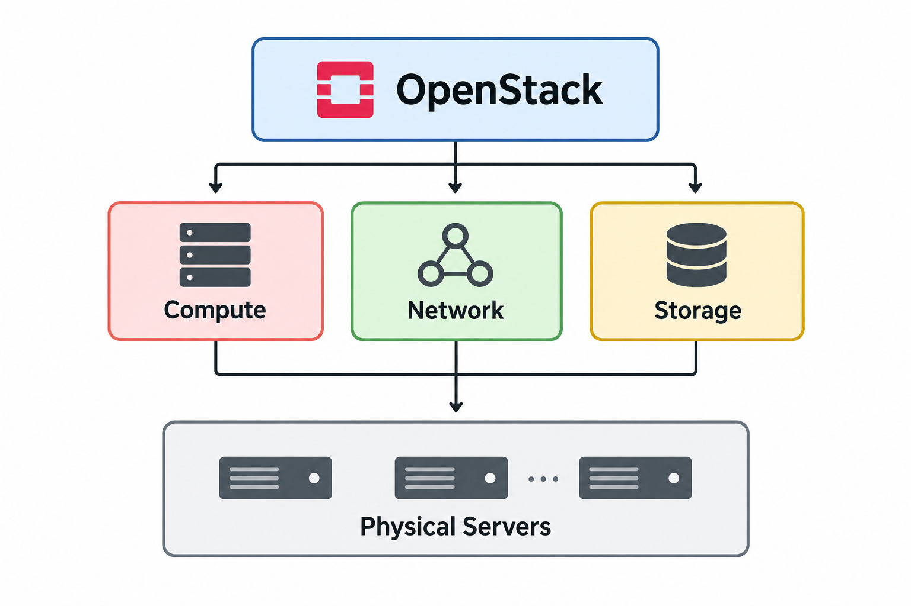
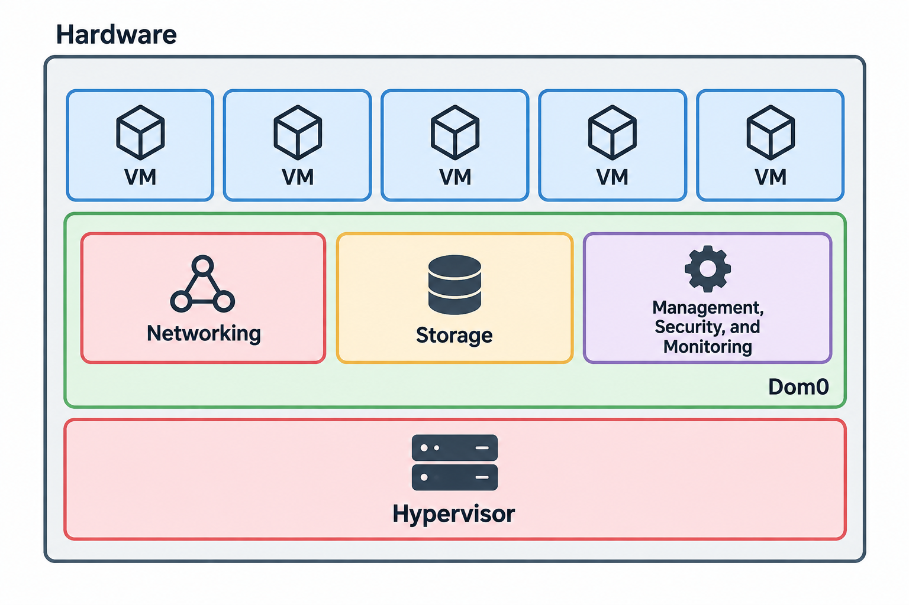

# OpenStack Architecture

> **학습 목표**
> 
> 
> OpenStack의 핵심 컴포넌트를 이해하고, 사용자의 인스턴스 생성 요청이 실제 VM으로 만들어지기까지 각 서비스가 어떻게 협력하는지 이해합니다.
> 

이번 주차에서는 OpenStack의 각 서비스를 개별적으로 외우기보다, **사용자가 "VM 하나 만들어줘"라고 요청했을 때 그 요청이 어떤 경로를 거치는지**를 중심으로 아키텍처를 정리했습니다.

OpenStack은 하나의 프로그램이 모든 기능을 처리하는 구조가 아닙니다. 인증은 Keystone, Compute는 Nova, Network는 Neutron처럼 역할별로 서비스가 분리되어 있으며, 각 서비스가 API와 Message Queue 등을 통해 통신하면서 하나의 Cloud Platform을 구성합니다.

---

# 1. OpenStack이란?

OpenStack은 **여러 서버의 Compute, Network, Storage 자원을 하나의 Resource Pool로 관리하고, 이를 API를 통해 사용자에게 제공하는 오픈소스 IaaS 플랫폼**입니다.

일반적인 운영체제가 한 서버 안의 CPU, Memory, Disk 등의 자원을 관리한다면 OpenStack은 그 범위를 데이터센터 수준으로 확장합니다.



> **Resource Pool**
> 
> 
> 여러 서버의 CPU와 Memory가 실제로 하나의 거대한 서버처럼 합쳐진다는 의미는 아닙니다.
> 
> OpenStack은 각 Compute Node가 가지고 있는 자원 상태를 관리하고, 사용자의 요청 조건을 만족하는 적절한 서버를 선택해 VM을 배치합니다.
> 

예를 들어 사용자가 다음과 같은 VM을 요청했다고 가정합니다.

| 항목 | 요청 |
| --- | --- |
| vCPU | 4 |
| RAM | 8GB |
| Image | Ubuntu |

OpenStack은 해당 조건을 처리할 수 있는 Compute Node를 찾고, Image와 Network 등을 준비한 뒤 실제 VM을 생성합니다.

이처럼 **사용자가 요청한 자원을 실제 사용할 수 있는 상태까지 준비하는 과정**을 Provisioning이라고 합니다.

---

## 1.1 가상화와 IaaS는 무엇이 다른가?

OpenStack을 이해하기 위해서는 먼저 **가상화와 IaaS의 차이**를 구분할 필요가 있습니다.

### 가상화와 Hypervisor

가상화는 물리 서버의 CPU, Memory, Storage 등의 자원을 추상화하여 **하나의 물리 서버에서 여러 VM을 실행할 수 있도록 만드는 기술**입니다.

이때 물리 자원을 VM에 할당하고 VM을 실행할 수 있도록 만드는 핵심 소프트웨어가 **Hypervisor**입니다.

특히 Type 1 Hypervisor는 하드웨어와 가까운 계층에서 직접 가상화를 수행하며, 물리 서버의 자원을 여러 VM이 나누어 사용할 수 있도록 합니다.



> **핵심**
> 
> 
> Hypervisor의 역할은 물리 자원을 가상화하여 여러 VM을 실행할 수 있는 환경을 만드는 것입니다.
> 

### IaaS는 무엇이 다른가?

IaaS는 단순히 VM을 실행하는 것보다 더 넓은 개념입니다.

가상화된 Compute 자원뿐만 아니라 Network, Storage 등의 인프라 자원을 사용자가 필요할 때 요청하고 사용할 수 있도록 **서비스 형태로 제공하는 Cloud Model**입니다.

| 구분 | 가상화 | IaaS |
| --- | --- | --- |
| 핵심 목적 | 물리 자원 추상화 | 인프라 자원의 서비스화 |
| 주요 대상 | VM | Compute, Network, Storage |
| 사용자 접근 | Hypervisor 중심 | API, CLI, Dashboard |
| 관계 | 기반 기술 | 가상화 위의 상위 서비스 모델 |

> **정리**
> 
> 
> 가상화가 물리 자원을 추상화하여 VM을 실행하기 위한 기반 기술이라면, IaaS는 이러한 자원을 사용자에게 서비스 형태로 제공하는 상위 개념입니다.
> 

### OpenStack에서는?

OpenStack은 Hypervisor 자체가 아니라 **IaaS 환경을 구축하기 위한 플랫폼**입니다.

사용자가 OpenStack에 VM 생성을 요청하면 Nova가 VM의 생명주기를 관리하고, 실제 VM을 실행하는 단계에서는 가상화 기술을 이용합니다.

`OpenStack → Nova → nova-compute → libvirt → QEMU/KVM → VM`

각 계층의 역할은 다음과 같습니다.

| 계층 | 역할 |
| --- | --- |
| **OpenStack** | Compute, Network, Storage, Identity 등의 인프라 자원을 API로 제공합니다. |
| **Nova** | VM 생성, 삭제, 상태 관리 등 Compute 서비스를 담당합니다. |
| **nova-compute** | Compute Node에서 실제 VM 관련 작업을 수행합니다. |
| **libvirt** | Nova와 QEMU/KVM 사이에서 가상화 기술을 제어하는 Interface입니다. |
| **KVM** | Linux Kernel의 Hardware Virtualization 기능을 제공합니다. |
| **QEMU** | VM Process와 가상 Hardware를 실행합니다. |
| **VM** | 최종적으로 사용자에게 제공되는 가상 머신입니다. |

> **정리**
> 
> 
> Hypervisor는 물리 자원을 가상화하여 VM을 실행하기 위한 기반 계층이고, OpenStack은 이러한 가상화 기술 위에서 Compute, Network, Storage 등의 인프라 자원을 통합하여 API 기반으로 제공하는 IaaS 플랫폼입니다.
> 

---

# 2. VM 하나를 만들기 위해 필요한 OpenStack 서비스

OpenStack은 여러 독립적인 서비스가 협력하는 구조입니다.

| 서비스 | 역할 | AWS에서 비슷한 개념 |
| --- | --- | --- |
| **Keystone** | 인증과 인가 | IAM |
| **Nova** | VM 생명주기 관리 | EC2 |
| **Neutron** | 가상 네트워크 | VPC |
| **Glance** | VM 부팅 Image | AMI |
| **Cinder** | Block Storage | EBS |
| **Horizon** | Web Dashboard | AWS Console |
| **Placement** | Compute 자원 Inventory | 직접 대응되는 사용자 서비스 없음 |

각 서비스를 따로 보는 것보다 **VM 생성 요청 하나를 기준으로 연결해서 보면 역할이 더 명확합니다.**

`User → Keystone → Nova → { Glance / Neutron / Cinder / Placement }`

Nova 혼자서는 VM을 완성할 수 없습니다.

- VM을 어느 서버에 배치할지는 **Placement**의 자원 정보가 필요합니다.
- 부팅할 OS Image는 **Glance**에서 가져옵니다.
- Network는 **Neutron**이 준비합니다.
- 별도의 Volume이 필요하다면 **Cinder**를 사용합니다.

---

# 3. 사용자가 인스턴스 생성 버튼을 누르면?

이번 주차에서 가장 중요하게 본 부분입니다.

AWS에서는 EC2 생성 버튼을 누르면 내부 과정을 직접 볼 수 없지만, OpenStack에서는 그 뒤에서 어떤 서비스가 동작하는지 직접 확인할 수 있습니다.

전체적인 VM 생성 과정은 다음과 같습니다.

`Horizon / CLI → Keystone → nova-api → nova-scheduler ↔ Placement → nova-compute → libvirt → QEMU/KVM → VM`

이 과정에서 Glance는 Image, Neutron은 Network, Cinder는 필요한 경우 Volume을 준비합니다.

> 아래 Step 1~6에서는 전체 VM 생성 과정을 단계별로 나누어 살펴봅니다.
> 

---

## Step 1. 사용자 인증

**Keystone — Identity Service**

가장 먼저 사용자는 Keystone에서 인증을 받습니다.

| 사용자 → Keystone | Keystone → 사용자 |
| --- | --- |
| ID / Password | Token |
| 인증 요청 | Service Catalog |

Keystone은 인증에 성공한 사용자에게 **Token과 Service Catalog**를 전달합니다.

Service Catalog에는 Nova, Neutron, Glance 등 OpenStack 서비스의 API Endpoint 정보가 들어 있습니다.

따라서 사용자가 각 서비스의 주소를 전부 알고 있을 필요가 없습니다.

---

## Step 2. Nova에 VM 생성 요청

**nova-api — VM 생성 요청 접수**

사용자는 발급받은 Token을 포함하여 Nova API에 인스턴스 생성을 요청합니다.

```
X-Auth-Token: <Token>
```

`nova-api`는 요청을 받은 뒤 DB에 생성하려는 인스턴스의 Record를 만들고 상태를 `BUILD`로 둡니다.

> **BUILD 상태 ≠ VM 생성 완료**
> 
> 
> 이 시점에는 Horizon에서 인스턴스가 보일 수 있지만 실제 QEMU VM Process가 만들어진 것은 아닙니다.
> 

---

## Step 3. VM을 실행할 Compute Node 결정

**nova-scheduler + Placement**

VM을 어느 Compute Node에 배치할지는 `nova-scheduler`가 결정합니다.

Scheduler는 Placement에서 각 Compute Node의 CPU와 Memory 등의 자원 정보를 조회합니다.

`Placement → Candidate Compute Nodes → Filter → Weigh → Selected Compute Node`

| 단계 | 역할 |
| --- | --- |
| **Placement** | Compute Node의 Resource Inventory를 관리하고 Candidate 정보를 제공합니다. |
| **Candidate Compute Nodes** | 요청한 자원을 제공할 수 있는 Compute Node 후보입니다. |
| **Filter** | 조건을 만족하지 못하는 Compute Node를 제외합니다. |
| **Weigh** | 남은 Compute Node에 점수를 부여합니다. |
| **Selected Compute Node** | 최종적으로 VM을 실행할 Node입니다. |

> **Placement와 Scheduler의 차이**
> 
> 
> Placement가 직접 VM을 배치하는 것은 아닙니다.
> 
> Placement는 Compute Resource 정보를 제공하고, **최종 Host 선택은 nova-scheduler가 수행합니다.**
> 

---

## Step 4. Compute Node에 작업 전달

**RabbitMQ — Control Plane의 작업 전달**

배치가 결정되면 실제 VM 생성 작업은 선택된 Node의 `nova-compute`가 수행합니다.

Nova 내부 Component는 직접 REST로 서로를 호출하는 대신 RabbitMQ를 이용한 RPC 방식으로 작업을 전달합니다.

`Nova Control Plane → RabbitMQ → nova-compute`

RabbitMQ의 내부 구조와 사용하는 이유는 뒤의 **4.2 Nova 내부에서는 RabbitMQ**에서 자세히 살펴봅니다.

---

## Step 5. VM에 필요한 자원 준비

Compute Node만 결정했다고 VM을 바로 실행할 수 있는 것은 아닙니다.

VM을 실행하기 위한 여러 자원이 추가로 필요합니다.

| 서비스 | 준비하는 자원 |
| --- | --- |
| **Glance** | OS Image |
| **Neutron** | Port, MAC, IP |
| **Cinder** | Volume, 필요한 경우 |

> 이 단계에서는 Image 다운로드, Network Port 생성, IP 할당, Volume 연결과 같은 실제 I/O 작업이 발생합니다.
> 

---

## Step 6. 실제 VM 실행

**Compute Node — VM 생성**

필요한 준비가 끝나면 `nova-compute`가 libvirt를 통해 VM 생성을 요청합니다.

`nova-compute → libvirt → QEMU/KVM → VM`

libvirt가 VM에 대한 정의를 만들고 QEMU Process가 실행되면서 실제 VM이 만들어집니다.

생성이 완료되면 인스턴스 상태가 `ACTIVE`로 변경됩니다.

---

# 4. OpenStack 서비스들은 어떻게 통신할까?

> **OpenStack은 통신 목적에 따라 REST API와 RabbitMQ/RPC를 구분하여 사용합니다.**
> 

| 통신 | 방식 | 예시 |
| --- | --- | --- |
| 서비스 ↔ 서비스 | **REST API** | Nova ↔ Glance, Nova ↔ Neutron |
| 서비스 내부 Component ↔ Component | **RabbitMQ / RPC** | Nova 내부 Component |

---

## 4.1 서비스 간 통신 — REST API

**서로 다른 OpenStack 서비스는 REST API를 통해 통신합니다.**

예를 들어 사용자가 다음 명령을 실행합니다.

```
openstack server list
```

내부적으로는 Nova API에 HTTP 요청이 전달됩니다.

```
GET /v2.1/servers
X-Auth-Token: <Token>
```

OpenStack의 CLI, Horizon, SDK는 겉으로 보이는 사용 방법만 다를 뿐 최종적으로는 API를 사용합니다.

---

## 4.2 Nova 내부에서는 RabbitMQ

**Nova 내부 Component들은 RabbitMQ를 이용한 RPC 방식으로 작업을 전달합니다.**

Nova는 하나의 Process로 동작하지 않습니다.

`nova-api / nova-scheduler / nova-conductor / nova-compute`

RabbitMQ의 기본적인 Message 전달 구조는 다음과 같습니다.

`Producer → Exchange → Binding → Queue → Consumer`

| 요소 | 역할 |
| --- | --- |
| **Producer** | Message를 발행합니다. |
| **Exchange** | Message를 분류합니다. |
| **Binding** | Exchange와 Queue 사이의 Routing Rule입니다. |
| **Queue** | Message를 저장합니다. |
| **Consumer** | Message를 가져와 처리합니다. |

OpenStack RPC에는 `call`과 `cast`라는 호출 방식이 있습니다.

| 방식 | 특징 |
| --- | --- |
| **call** | 응답을 기다리는 동기 방식입니다. |
| **cast** | 요청을 전달하고 응답을 기다리지 않는 비동기 방식입니다. |

VM 생성처럼 오래 걸리는 작업에서는 비동기적인 처리가 필요합니다.

### 왜 Message Queue를 사용할까?

> **1. 비동기 처리**
> 
> 
> VM 생성이 완료될 때까지 API가 계속 기다리지 않고 작업을 Queue에 전달한 뒤 다른 요청을 처리할 수 있습니다.
> 

> **2. Component 간 결합도 감소**
> 
> 
> 송신 측이 대상 Process를 직접 호출하는 대신 Message Queue를 통해 작업을 전달할 수 있습니다.
> 

> **3. 수평 확장**
> 
> 
> Compute Node가 증가하더라도 여러 Worker가 Message를 처리하는 구조로 확장할 수 있습니다.
> 

---

# 5. OpenStack이 의존하는 공용 인프라

OpenStack을 배포하면 Nova와 Neutron 같은 OpenStack 서비스만 실행되는 것은 아닙니다.

OpenStack 서비스가 동작하기 위해 MariaDB, RabbitMQ, Memcached 등의 외부 소프트웨어도 함께 사용됩니다.

| 서비스 | 역할 | 장애 발생 시 영향 |
| --- | --- | --- |
| **MariaDB** | OpenStack 서비스의 상태를 영구 저장합니다. | 상태 조회 및 변경이 어려워질 수 있습니다. |
| **RabbitMQ** | 내부 RPC Message를 전달합니다. | Component 사이의 작업 전달이 중단될 수 있습니다. |
| **Memcached** | 반복되는 정보를 Memory에 Cache합니다. | Cache Miss가 증가하여 인증 및 API 처리 부하가 증가할 수 있습니다. |
| **HAProxy** | Multi-node 환경에서 API 요청을 Load Balancing합니다. | API Endpoint 접근에 영향을 줄 수 있습니다. |

> **공용 인프라의 장애는 영향 범위가 큽니다.**
> 
> 
> 이 서비스들은 여러 OpenStack Component가 공통으로 사용하기 때문에 하나의 장애가 여러 서비스에 영향을 줄 수 있습니다.
> 

---

# 6. Nova 내부 구조

Nova는 VM 생명주기를 관리하는 Compute Service이지만 실제로는 여러 Component로 나뉩니다.

`nova-api → nova-scheduler ↔ Placement → nova-conductor → nova-compute`

### Nova 주요 Component

| Component | 역할 |
| --- | --- |
| **nova-api** | 외부의 REST API 요청을 받는 진입점입니다. |
| **nova-scheduler** | Placement의 자원 정보를 이용하여 VM을 실행할 Compute Node를 선택합니다. |
| **nova-conductor** | Compute Node와 중앙 DB 사이에서 중계 역할을 하며, Compute Node가 DB에 직접 접근하지 않도록 합니다. |
| **nova-compute** | 각 Compute Node에서 실행되며 실제 가상화 계층과 연결하여 VM 생성, 삭제 등의 작업을 수행합니다. |

> **nova-conductor를 두는 이유**
> 
> 
> Compute Node가 중앙 DB에 직접 접근하지 않도록 중계 역할을 수행합니다. 이를 통해 DB 접근을 Control Plane 측에 제한할 수 있습니다.
> 

---

# 7. VM은 실제로 누가 실행할까?

> **Nova는 VM의 생명주기를 관리하지만 Nova 자체가 CPU 가상화를 수행하는 것은 아닙니다.**
> 

실제 VM 실행 계층은 다음과 같습니다.

`nova-compute → libvirt → QEMU/KVM → VM`

| 구성요소 | 역할 |
| --- | --- |
| **nova-compute** | OpenStack의 VM 작업을 실제 가상화 계층에 전달합니다. |
| **libvirt** | 가상화 기술을 공통된 방식으로 관리하는 Interface입니다. |
| **KVM** | Linux Kernel의 Hardware Virtualization 기능입니다. |
| **QEMU** | VM Process와 가상 Hardware를 실행합니다. |

### libvirt

QEMU/KVM 등의 가상화 기술을 공통된 방식으로 제어할 수 있도록 해주는 추상화 계층입니다.

Nova는 직접 QEMU의 세부 구현을 제어하기보다 libvirt를 이용합니다.

### KVM

Linux Kernel이 제공하는 가상화 기능입니다.

CPU의 Intel VT-x 또는 AMD-V와 같은 Hardware Virtualization 기능을 이용하여 Guest의 CPU 명령을 실행합니다.

### QEMU

Guest VM과 가상 Hardware를 실행합니다.

KVM을 사용할 수 있다면 CPU 실행을 KVM을 통해 가속할 수 있지만, KVM을 사용할 수 없다면 QEMU가 CPU까지 Software Emulation해야 하므로 성능이 크게 떨어집니다.

> **정리**
> 
> 
> Nova는 **VM을 관리**하고, libvirt는 **가상화 계층을 제어**하며, QEMU/KVM이 **실제로 VM을 실행**합니다.
> 

---

# 8. Neutron은 VM의 네트워크를 어떻게 만드는가?

VM을 띄웠다고 해서 바로 다른 VM이나 외부 인터넷과 통신할 수 있는 것은 아닙니다.

OpenStack에서는 **Neutron이 가상 Network를 담당합니다.**

이번 실습에서는 **Open vSwitch 방식**을 사용합니다.

`neutron-server → ML2 → RabbitMQ RPC → Agents → OVS`

### Neutron 주요 Component

| Component | 역할 |
| --- | --- |
| **neutron-server** | Neutron API 요청을 처리합니다. |
| **ML2** | Neutron과 실제 Network Backend를 연결합니다. |
| **OVS Agent** | 각 Node의 OVS 설정을 담당합니다. |
| **L3 Agent** | Routing과 NAT를 담당합니다. |
| **DHCP Agent** | VM에 IP를 할당합니다. |
| **OVS** | 실제 가상 Switching을 수행합니다. |

---

## 8.1 OVS Bridge

OVS에서는 용도에 따라 여러 Bridge를 사용합니다.

| Bridge | 역할 |
| --- | --- |
| **br-int** | VM Interface가 연결되는 Integration Bridge입니다. |
| **br-tun** | VXLAN 등의 Overlay Tunnel을 처리합니다. |
| **br-ex** | External Network와 연결됩니다. |

---

## 8.2 Network Namespace

L3 Agent는 Linux의 **Network Namespace(netns)**를 이용해 가상 Router를 구현합니다.

Network Namespace는 각각 독립적인 Network Interface, Routing Table, Firewall Rule 등을 가질 수 있는 격리된 Network Stack입니다.

| Namespace 내부 요소 | 역할 |
| --- | --- |
| **Network Interface** | Namespace가 사용하는 Network Interface입니다. |
| **Routing Table** | Packet을 어느 경로로 전달할지 결정합니다. |
| **Firewall Rule** | Network Traffic에 대한 Filtering Rule을 적용합니다. |

> OpenStack의 가상 Router가 단순히 논리적으로만 존재하는 것이 아니라 Linux의 Network Namespace를 이용해 실제로 구현됩니다.
> 

---

# 9. 서로 다른 Compute Node의 VM은 어떻게 같은 네트워크를 사용할까?

예를 들어 VM 두 대가 서로 다른 Compute Node에 존재한다고 가정합니다.

`Compute Node A (VM-A) ← VXLAN Tunnel → Compute Node B (VM-B)`

VM-A와 VM-B는 서로 다른 물리 서버에 있지만 VM 입장에서는 같은 `10.0.0.0/24` Network에 존재할 수 있습니다.

이를 가능하게 하는 것이 **Overlay Network**입니다.

---

## 9.1 Encapsulation

VM이 보내는 원래 Frame을 물리 Network에서 전달할 수 있는 새로운 Packet 안에 넣습니다.

| 구성 | 내용 |
| --- | --- |
| **Outer Ethernet** | 물리 Network의 Ethernet Header입니다. |
| **Outer IP** | Compute Node 간 통신에 사용하는 IP Header입니다. |
| **UDP** | VXLAN은 기본적으로 UDP `4789`를 사용합니다. |
| **VXLAN Header** | Tenant Network를 구분하기 위한 VNI가 포함됩니다. |
| **Inner Frame** | VM이 원래 전송한 Ethernet Frame입니다. |

> **물리 Network에서는 어떻게 보일까?**
> 
> 
> 물리 Router는 VM의 `10.0.0.x` 주소를 직접 Routing하는 것이 아니라 **Compute Node 사이에서 전달되는 일반적인 IP/UDP Packet**으로 인식합니다.
> 

따라서 물리 Network는 Tenant Network의 IP 대역이나 VM의 MAC 주소를 직접 알 필요가 없습니다.

---

## 9.2 VLAN과 VXLAN

| 구분 | VLAN | VXLAN |
| --- | --- | --- |
| Identifier | VLAN ID | VNI |
| Bit | 12bit | 24bit |
| Network 규모 | 약 4K | 약 16M |
| 방식 | 물리 L2 분리 | Overlay Network |

VLAN은 802.1Q의 12bit VLAN ID를 사용하기 때문에 사용할 수 있는 Network 수에 한계가 있습니다.

VXLAN은 24bit VNI를 사용하므로 훨씬 많은 논리 Network를 구분할 수 있습니다.

> 따라서 대규모 Multi-tenant Cloud 환경에서는 Overlay Network를 이용하여 **Underlay와 Tenant의 논리 Network를 분리**할 수 있습니다.
> 

---

# 10. OVS와 OVN

OpenStack Neutron을 구성하는 방식에는 **OVS 기반 방식과 OVN 방식**이 있습니다.

| 구분 | OVS 방식 | OVN 방식 |
| --- | --- | --- |
| 제어 전달 | RabbitMQ RPC | DB 기반 |
| Node 구성 | 여러 Neutron Agent | ovn-controller |
| L3 Routing | L3 Agent + netns | 분산 Routing |
| 방식 | 명령형 | 선언형 |

### OVS

`Neutron → RabbitMQ → Agents → OVS`

각 Node의 Agent가 명령을 받아 OVS 설정을 변경하는 구조입니다.

### OVN

`Neutron → Northbound DB → ovn-northd → Southbound DB → ovn-controller → OVS`

OVN은 Northbound DB에 원하는 논리 Network 상태를 저장하고, `ovn-northd`가 이를 Southbound DB의 실행 정보로 변환합니다.

각 Node의 `ovn-controller`는 이 정보를 바탕으로 실제 OVS Flow를 구성합니다.

> **그렇다면 왜 이번 스터디에서는 OVS를 사용할까?**
> 
> 
> 새로운 대규모 환경에서는 OVN이 더 적합할 수 있지만 이번 스터디에서는 OVS를 사용합니다.
> 
> 그 이유는 6회차에 `netns` 내부로 직접 들어가 **OpenStack 가상 Router가 Linux 위에서 실제로 어떻게 구현되는지 확인하는 실습**을 하기 때문입니다.
> 
> 즉, 최신 기술을 사용하는 것이 무조건 정답이라기보다 이번에는 **학습 목적에 더 적합한 OVS를 선택한 것**으로 이해했습니다.
> 

---

# 11. 추가로 공부한 내용

## 11.1 Ceph

Ceph은 OpenStack에서 Storage Backend로 활용할 수 있는 분산 Storage입니다.

| 구성요소 | 역할 |
| --- | --- |
| **MON** | Cluster Map과 상태를 관리합니다. |
| **OSD** | 실제 Data 저장, 복제, 복구를 담당합니다. |
| **MDS** | CephFS의 Metadata를 관리합니다. |
| **MGR** | Monitoring과 관리 기능을 제공합니다. |
| **RBD** | Block Device를 제공합니다. |
| **CRUSH** | Data가 저장될 위치를 계산합니다. |

OpenStack에서는 Cinder나 Glance의 Backend로 RBD를 사용할 수 있습니다.

---

## 11.2 Kolla-Ansible

Kolla는 OpenStack 각 서비스를 Container 형태로 제공합니다.

Kolla-Ansible은 Ansible을 사용하여 이러한 Container의 설정과 배포를 자동화합니다.

> **이번 스터디에서 Kolla-Ansible을 사용하는 이유**
> 
> 
> 각 서비스가 Container로 분리되어 있어 구조를 확인하기 쉽고, Ansible을 통한 반복 가능한 배포가 가능하며, 실제 OpenStack 환경에서 활용되는 배포 방식을 경험할 수 있기 때문입니다.
> 

---

# Part A. 확인 질문

## Q1. Nova, Neutron, Glance, Keystone을 AWS 서비스와 대응시키고 Keystone이 모든 요청의 관문인 이유를 설명하면?

| OpenStack | AWS |
| --- | --- |
| Nova | EC2 |
| Neutron | VPC |
| Glance | AMI |
| Keystone | IAM |

OpenStack의 사용자는 먼저 Keystone에 ID와 Password를 전달하여 인증을 요청합니다.

인증에 성공하면 Keystone은 **Token과 Service Catalog**를 전달합니다.

이후 사용자가 Nova 등의 API를 호출할 때 해당 Token을 `X-Auth-Token`에 포함하여 요청합니다. 서비스는 Token의 유효성을 확인한 뒤 권한이 있는 요청만 처리합니다.

따라서 Nova, Neutron 등의 서비스를 사용하려면 공통 인증 체계인 Keystone에서 발급받은 인증 정보가 필요하기 때문에 Keystone을 **모든 요청의 관문**이라고 표현할 수 있습니다.

---

## Q2. nova-api와 nova-compute는 왜 REST가 아니라 Message Queue로 통신하는가?

핵심 이유는 **비동기 처리, 결합도 감소, 수평 확장**입니다.

### 1. 비동기 처리

VM 생성은 즉시 완료되는 작업이 아니므로 API가 VM 생성이 끝날 때까지 기다리게 하는 것보다 작업을 Message Queue에 전달하고 다른 요청을 처리하는 것이 효율적입니다.

### 2. Component 간 결합도 감소

nova-api가 nova-compute를 직접 호출하는 방식보다 Queue를 사이에 두면 상대 Process와 직접 강하게 연결될 필요가 없습니다.

### 3. 수평 확장

Compute Node가 여러 대가 되어도 Message를 이용해 작업을 전달할 수 있기 때문에 규모가 커지는 환경에 대응하기 쉽습니다.

---

## Q3. MariaDB, RabbitMQ, Memcached의 역할과 장애가 발생하면 어떤 문제가 생기는가?

| 구성요소 | 역할 | 장애 발생 시 |
| --- | --- | --- |
| **MariaDB** | 지속적인 상태 저장 | 상태 조회 및 변경 문제 |
| **RabbitMQ** | RPC Message 전달 | Component 간 작업 전달 문제 |
| **Memcached** | Cache | Cache Miss 증가, 인증/API 처리 성능 영향 |

MariaDB에 장애가 발생하면 각 OpenStack 서비스가 필요한 상태 정보를 읽거나 변경하기 어려워집니다.

RabbitMQ에 장애가 발생하면 API에서 요청을 받더라도 Scheduler나 Compute 등의 Component로 작업을 정상적으로 전달하지 못할 수 있습니다.

Memcached에 장애가 발생하면 Cache를 이용할 수 없어 인증 및 API 처리 과정의 부하와 지연이 증가할 수 있습니다.

---

# Part B. 심화 확인 질문

## Q1. VM 생성 과정에서 1~4단계보다 5~6단계가 오래 걸리는 이유는?

1~4단계에서는 다음과 같은 작업이 수행됩니다.

`인증 → DB Record → Placement 조회 → Scheduling → Message 전달`

주로 비교적 가벼운 **Control Plane 작업**입니다.

반면 5~6단계에서는 다음 작업이 발생합니다.

- Glance Image 다운로드
- Neutron Port와 IP 준비
- Cinder Volume 연결
- QEMU Process 생성
- Guest OS Booting

즉, 후반부에는 Network와 Storage I/O, Process 생성, Guest OS Booting 등의 실제 작업이 발생하기 때문에 더 많은 시간이 필요합니다.

---

## Q2. OVS 방식에서 Node가 수백 대로 증가하면 어디가 병목이 되고 OVN은 어떻게 회피하는가?

OVS 방식에서는 neutron-server가 RabbitMQ를 통해 각 Node의 여러 Agent에 변경 사항을 전달합니다.

Node 수와 Network 변경이 많아질수록 중앙의 RabbitMQ와 Neutron Agent를 이용한 RPC 처리량도 증가하기 때문에 Control Plane의 부담이 커질 수 있습니다.

OVN은 각 Node에 명령을 RPC로 계속 Push하는 대신 Northbound DB와 Southbound DB에 원하는 Network 상태와 실행 정보를 저장하고, 각 Node의 `ovn-controller`가 필요한 정보를 바탕으로 OVS Flow를 구성합니다.

따라서 중앙에서 각 Agent에 명령을 계속 전달하는 구조보다 대규모 환경에서 확장하기 유리합니다.

---

## Q3. VXLAN으로 캡슐화된 패킷을 물리 라우터는 어떤 패킷으로 인식하며, 그 덕분에 무엇이 가능한가?

물리 Router는 내부 VM의 IP Packet을 직접 보는 것이 아니라 Compute Node 간에 전달되는 **일반적인 IP/UDP Packet**으로 인식합니다.

VXLAN에서는 VM의 원본 Ethernet Frame을 새로운 IP/UDP Packet 안에 Encapsulation합니다.

`VM Ethernet Frame → VXLAN Encapsulation → Outer IP + UDP + VXLAN Header + Original Frame → 다른 Compute Node에서 Decapsulation`

따라서 물리 Network는 Tenant Network의 IP 대역이나 VM의 MAC 주소를 직접 알 필요가 없습니다.

그 결과 물리 Network인 **Underlay**와 Tenant의 논리 Network인 **Overlay**를 분리할 수 있고, 서로 다른 물리 서버에 존재하는 VM도 같은 논리 Network에 연결된 것처럼 통신할 수 있습니다.

---

## Q4. 이번 스터디에서 OVN 대신 OVS를 선택한 이유는?

OVN이 더 새로운 구조이고 대규모 환경에서 장점이 있지만, 이번 스터디의 목적은 단순히 최신 기술을 사용하는 것이 아니라 **OpenStack Network가 실제 Linux 위에서 어떻게 구현되는지 직접 확인하는 것**입니다.

OVS 방식에서는 Neutron L3 Agent가 Network Namespace를 이용하여 가상 Router를 구현합니다.

따라서 6회차 실습에서 `ip netns` 등을 이용해 실제 Router Namespace 안으로 들어가 Interface와 Routing 구조를 확인할 수 있습니다.

OVN은 이러한 L3 Routing을 전통적인 qrouter netns 방식으로 구현하지 않기 때문에 같은 방식의 실습에는 적합하지 않습니다.

> **정리**
> 
> 
> 이번 스터디에서는 **기술의 최신성보다 학습 목적에 맞는 구조를 선택했기 때문에 OVS를 사용합니다.**
>