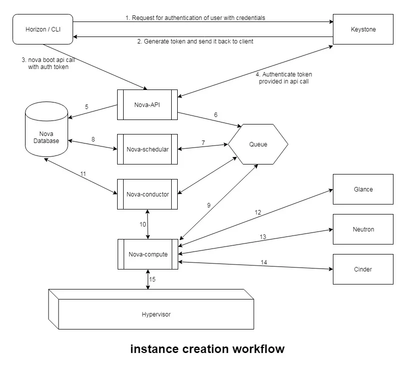

### Nova 전체 과정

server create는 한 컴토넌트가 다 하는 작업은 아니다.
VM 생성은 사실상 여러 컴포넌트가 릴레이처럼 넘겨받으면서 처리하는 작업이다. 

- Controller
    - Keystone
    - Nova API
    - Nova Scheduler
    - Queue
    - Placement
    - Neutron / Glacne / Cinder 등
- Compute Node
    - Nova-compute
    - Neutron Agent (linuxbridge, dhcp, metadata)

[전체 흐름 요약]
1. 사용자가 인증을 받음 (keystone에 인증 요청을 보내 토큰을 받음)
2. 사용자가 nova api에 server create 요청을 보냄
3. nova api가 keystone 토큰을 검증함
4. nova api가 db에 인스턴스 초기 레코드를 만들음
5. nova api가 queue에 build 요청을 넣음 > nova api는 직접 vm을 만들지 않음
6. scheduler가 메시지를 받고 스케줄링 시작 > 어느 호스트에 인스턴스를 배치할 지 판단
7. 후보 호스트들을 필터링하고 남은 호스트들에 가중치를 매김 
8. 호스트를 하나 선택하거나 실패
9. 선택된 호스트의 nova-compute로 메시지 전달
10. nova-compute가 생성  준비 시작
11. neutron 네트워크 리소스, glance 이미지 자원, cidner 스토리지 연결 준비 등
12. nova-compute가 hypervisor driver 호출
13. hypervisor가 실제 vm domain 생성 
14. nova-compute는 결과와 상태를 conductor를 통해 반영
15. 최종 상태가 ACTIVE 또는 ERROR로 수렴 

### Neutron

openstack network agent list | grep -i 'hostname'
> linux-bridge agent, dhcp agnet, metadata agent 

1. linux-bridge agent:

    하나의 물리 호스트 안에서도 Network 별로 Bridge를 논리적으로 분리하여 사용

2. dhcp agent:

    - Guest OS는 DHCP를 통해 IP를 할당 받음
        - Discover: Guest OS가 DHCP 서버를 찾기 위해 Broadcast로 요청
        - Offer: DHCP 서버가 사용할 수 있는 IP를 제안
        - Request: Guest OS가 제안받은 IP를 사용하겠다고 요청
        - ACK: DHCP 서버가 IP 사용을 최종 승인
    
    - namespace 
        - ip netns exec NETNS COMMAND...
        - 하나의 호스트 안에서 여러 네트워크를 분리 > qdhcp namespace 
        - namespace 안에서는 dhcp 프로세스인 qdhcp가 동작

    - dhcp agent를 통해 routing table를 받기 때문에 metadata agent 전에 선행되어야함

3. metadata agent

    - Guest OS는 metadata agent를 통해 정보를 가져옴 > 169.254.169.254
    - 요청하는 패키지는 cloud-init
        - openstack server create 후 VM이 생성되는 과정은 cloud-init-output.log에서 확인 가능
    - metadata agent는 nova와 neutron 둘 다 있음 
        - 왜 neutron을 거쳐서 가는가? > IP는 neutron에 있기 때문에 인스턴스를 식별해줌