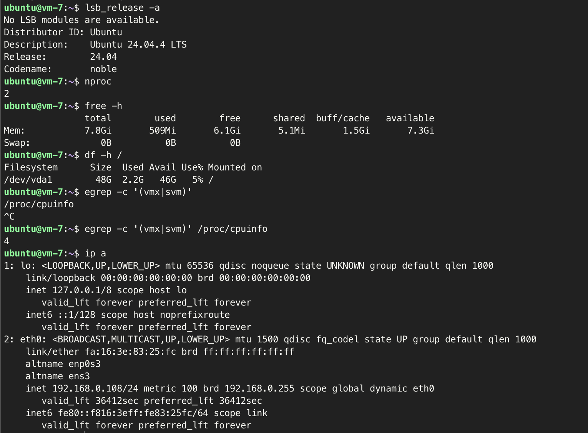

# 개요
> **주제: 버튼 뒤의 6단계 + VM 준비**
> **세부 내용: 인스턴스 생성 흐름 이론 + 가비아 VM 생성·SSH 접속**
> **이론: "인스턴스 생성" 버튼 하나가 내부에서 통과하는 6단계 학습**
> **실습: 가비아 VM에 SSH로 접속하고, 서버 상태를 명령어로 검증**

# 이론
## "인스턴스 생성" 버튼 뒤의 6단계
Create Instance 버튼 한 번이 실제로는 여러 서비스가 이어서 처리하는 분산 작업이다.

아래의 6단계로 구성된다.
1. 인증        Horizon/CLI → Keystone: 토큰 발급
2. 접수        nova-api: 요청 수신, DB에 레코드 생성 (상태 BUILD)
3. 배치 결정   scheduler: Placement 조회 → Filter/Weigh → 노드 확정
4. 작업 수신   nova-compute: RabbitMQ로 지시 수신
5. 준비물 수집  Glance(이미지) · Neutron(포트/IP) · Cinder(볼륨)
6. 기동        libvirt → QEMU: VM 프로세스 실행, 상태 ACTIVE

### 1단계 - Keystone 인증
사용자가 "VM 생성하고 싶다"고 요청을 보내면, Keystone에서 ID/Password로 인증하고 토큰을 발급한다. 이후에 Nova API 요청을 보낼 때 `X-Auth-Token` 헤더로 첨부한다.

이 단계에서 아직 VM 생성은 시작되지 않았고, 사용자가 요청할 자격이 있나만 확인한다.

**흐름**
```
Client
   │
   │ ID / Password / Project
   ▼
Keystone :5000
   │
   │ Token
   ▼
Client
```

### 2단계 - nova-api가 요청 접수
nova-api가 요청을 받으면 우선 토큰을 검증하고, 요청 내용의 형식을 검증한다.
문제가 없으면 DB에 바로 레코드를 만들고, 상태를 BUILD로 기록한다.
**이때 실제 VM은 만들어지지 않았지만 Horizon에서는 이미 `my-instance Status: BUILD`처럼 보일 수도 있다.** 만약 VM 생성이 1분 걸린다고 해서 사용자가 1분 동안 아무것도 못 보는 것보다, `요청 접수 -> BUILD 상태 생성 -> 뒤에서 작업 진행 -> ACTIVE 변경`의 형태가 더 좋기 때문에 생성 완료 전에 먼저 DB에 기록을 남긴다. (DB상의 제어 상태와 실제 하이퍼바이저상의 VM 실체 사이에 시간차 발생)

### 3단계 - scheduler가 어디에 만들지 배치 결정
VM을 어느 물리 서버에 만들지 결정한다.

**Placement에서 자원 조회**
우선 scheduler는 각 Compute Node의 현재 자원을 알아야 하기 때문에, Placement를 조회하여 각 노드의 잔여 자원(vCPU, 메모리, 디스크)를 알아낸다.

**Filter**
그 다음 Filter로 조건에 안 맞는 서버를 제외한다.

**Weigh**
이후 남은 후보에 점수를 매겨 한 대를 선정한다.

### 4단계 - nova-compute가 작업 수신
scheduler에서 결정한 compute node에 있는 `nova-compute`에게 `RabbitMQ` + `RPC cast`로 일을 전달한다. VM 생성은 오래 걸리기 때문에 비동기 방식인 cast를 이용한다.

### 5단계 - 준비물 수집
nova-compute가 세 곳에 요청을 보낸다.
- Glance (OS 이미지): 부팅 이미지를 다운로드한다. 처음 쓰는 이미지는 네트워크로 받아와야 해서 오래 걸리고, 한 번 받은 이미지는 로컬에 캐시되어 두 번째부터는 빠르다.
- Neutron (네트워크 준비): VM의 virtual NIC가 OpenStack 가상 네트워크에 연결될 때 사용하는 Port를 생성한다. Port에는 MAC 주소, IP 주소, Security Group, 연결할 Network 등의 정보가 설정된다.
	- Port에 있는 정보 예시
		- MAC address: fa:16:3e:12:34:56
		- IP address: 10.0.0.15
		- Network: private-net
		- Security Group: default
	- NIC 하나당 Port 하나라고 생각하면 쉽다.
	- Port를 별도로 관리하면 네트워크 정보를 VM과 분리해서 다룰 수 있다. 예를 들어 하나의 VM에 NIC를 두 개 붙일 수도 있다.
```bash
VM
├─ eth0 → Port A → private-net
└─ eth1 → Port B → management-net

# 서로 다른 네트워크에 동시에 연결 가능
Port A
IP 10.0.0.15

Port B
IP 192.168.10.20
```
- Cinder (디스크 - 선택): 추가로 볼륨을 붙이는 경우에만 필요하다.

### 6단계 - 실제 VM 기동
아래 프로세스를 거쳐 실제 VM이 띄워진다.
```
nova-compute
      ↓
   libvirt
      ↓
 QEMU + KVM
      ↓
     VM
```

**libvirt에게 VM 정의 전달**
- VM을 만들기 위해 필요한 정보 (CPU 몇 개, RAM 얼마, 어떤 NIC, 어떤 Image 등)를 libvirt가 이해할 수 있는 형태로 전달한다.
- 예시
```xml
<domain>
  <memory>4096...</memory>
  <vcpu>2</vcpu>
  ...
</domain>
```

성공적으로 실행되면 OpenStack 인스턴스 상태가 `BUILD` → `ACTIVE`로 바뀐다.

그런데 OpenStack 입장에서 `ACTIVE = QEMU VM을 성공적으로 띄웠다`는 뜻이기 때문에, 그 안의 OS는 이제 부팅하고 있을 수도 있다. 따라서 ACTIVE가 됐어도 SSH로 접속이 가능하기까지는 OS 부팅 시간만큼 추가로 소요된다.

### 단계별 소요 시간
1~4단계는 대부분 메타데이터 처리 + 판단 + 메시지 전달이기 때문에 상대적으로 빠르다.
- 인증 (수 초 미만)
- 접수 (수 초 미만)
- 스케줄링 (수 초)
- 작업 전달 (즉시)

5, 6단계는 이미지 다운로드, 네트워크 구성, 스토리지 준비, QEMU 실행과 같은 실제 작업을 하기 때문에 수십 초 이상이 소요된다. 인스턴스 생성이 느리면 5, 6단계를 의심해봐야 한다.

### Request ID
VM 생성이라는 하나의 요청에도 OpenStack의 다양한 서비스가 참여하기 때문에, 로그가 여기저기 흩어져 있다. 이때 하나의 요청에는 req-로 시작하는 request-id가 부여되고, 이 ID가 여러 서비스의 로그에 공통으로 찍혀서 이를 통해 요청을 추적할 수 있다.

- 예시
```
nova-api.log
req-abc123

nova-scheduler.log
req-abc123

nova-compute.log
req-abc123
```

---
# 실습
## 가비아 VM에 직접 접속
### 1. 키 파일 권한 설정 (macOS, Linux 환경만, Windows는 제외)
개인키 파일이 소유자 외에 다른 사람들도 읽을 수 있는 권한인 경우 SSH 접속을 거부한다. (`WARNING: UNPROTECTED PRIVATE KEY FILE!`)

따라서 chmod로 개인키 파일의 권한을 변경해야 한다.
- `600`: 소유자만 읽고 쓸 수 있다는 뜻.
```bash
chmod 600 ~/Downloads/mykey.pem
```

- 안 바꾸고 접속 시도했을 때 (권한 644)

### 2. 접속
```sh
ssh -i ./mykey.pem ubuntu@<공인IP>
```
### 3. 서버 환경 확인
- 아래 명령어로 서버 환경 확인
```sh
lsb_release -a        # OS 확인: Ubuntu 24.04인가
nproc                 # vCPU 개수
free -h               # 메모리
df -h /               # 루트 디스크 여유 공간
egrep -c '(vmx|svm)' /proc/cpuinfo   # 중첩 가상화 지원 여부
ip a                  # 네트워크 인터페이스와 IP
```

- 결과



## 자주 만나는 에러
| 메시지                             | 뜻                                  | 조치                            |
| ------------------------------- | ---------------------------------- | ----------------------------- |
| `Permission denied (publickey)` | 키가 틀렸거나 계정명이 틀림                    | `-i` 경로, 계정명(ubuntu) 확인       |
| `UNPROTECTED PRIVATE KEY FILE`  | 키 파일 권한이 너무 열려 있음                  | `chmod 600 <키파일>`             |
| `Connection timed out`          | 네트워크가 서버까지 못 감 (방화벽, ip 문제)        | IP 오타, 방화벽(22번 포트), 내 네트워크 확인 |
| `Connection refused`            | 서버까진 갔는데 22번에서 응답 거부 (서버 쪽 서비스 문제) | 서버 부팅 직후면 잠시 대기               |
