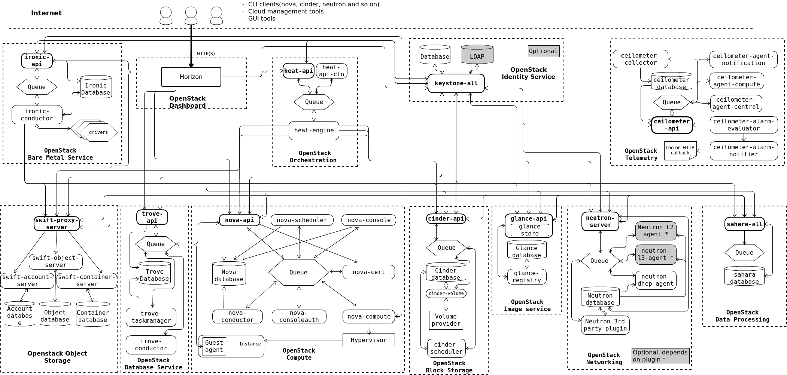
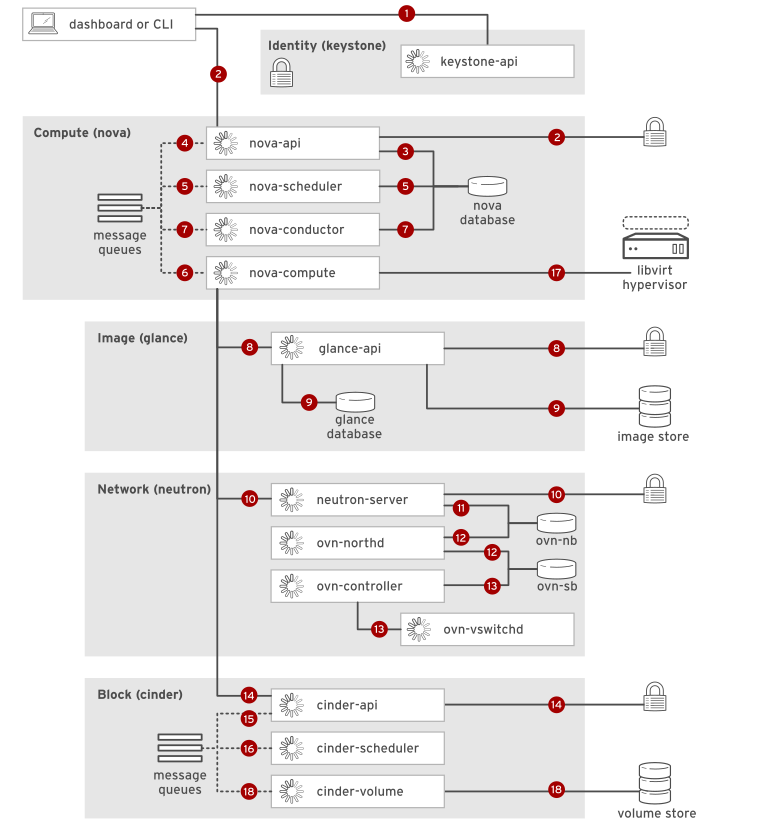
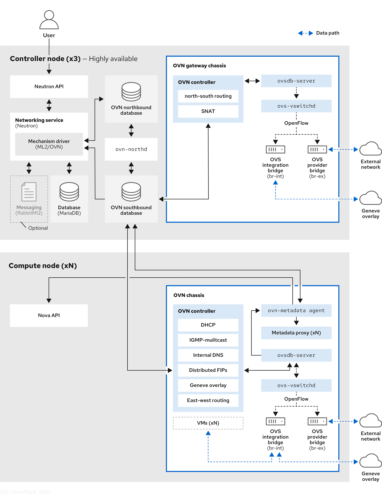
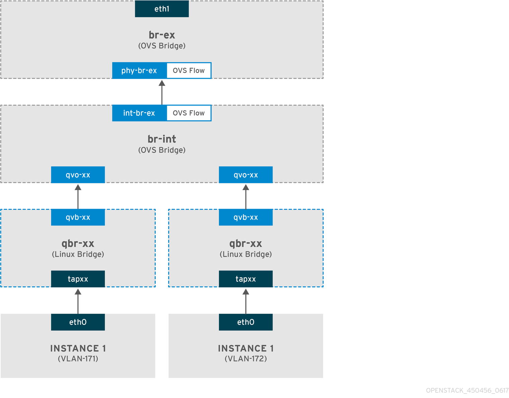

# 2회차 학습 정리 — OpenStack 아키텍처

> 학습 목표: OpenStack의 주요 구성 요소와 요청 흐름을 연결하고, 각 서비스가 소유하는 상태와 실제 실행 계층의 관계를 이해한다.

이 문서는 공부한 내용을 하나의 흐름으로 정리했다. 설명의 근거는 실습 버전과 같은 OpenStack 2026.1 공식 문서를 우선 사용했으며, 버전에 크게 종속되지 않는 API와 라이브러리 개념은 OpenStack의 공통 공식 문서를 참고했다. 각 장의 질문에는 학습한 내용을 바탕으로 직접 답을 작성한다.

---

## 1. OpenStack이란 무엇인가

### 1-1. 데이터센터를 위한 클라우드 운영체제

OpenStack은 데이터센터의 컴퓨팅·스토리지·네트워크 자원을 하나의 자원 풀처럼 관리하고, 공통 인증 체계를 갖춘 API로 이를 제공하는 오픈소스 IaaS 플랫폼이다.

일반 운영체제가 한 컴퓨터의 CPU와 메모리를 여러 프로세스에 나누어 준다면, OpenStack은 여러 서버의 자원을 프로젝트와 사용자에게 나누어 준다. 사용자가 요청한 자원을 준비해 실제로 사용할 수 있는 상태로 만드는 과정을 **프로비저닝**이라고 한다.

Horizon에서 버튼을 누르거나 CLI·SDK를 사용하더라도 최종 목적지는 각 서비스의 REST API다. 따라서 Horizon, CLI, SDK는 서로 다른 기능을 가진 별도 제어 시스템이 아니라 같은 API를 이용하는 서로 다른 클라이언트다.

OpenStack을 이용하면 퍼블릭 클라우드에서 제공하는 것과 유사한 다음 자원을 직접 운영할 수 있다.

- 가상 서버
- 가상 네트워크와 라우터
- 이미지와 블록 스토리지
- 사용자·프로젝트·권한
- 로드밸런서, DNS, 오케스트레이션 등의 확장 서비스

이번 실습의 OpenStack 버전은 **2026.1 Gazpacho**다. 2026년 4월 1일 최초 공개되었으며 Nova 33.0, Neutron 28.0, Glance 32.0, Keystone 29.0, Cinder 28.0, Placement 15.0 등이 한 릴리스를 구성한다. 정확한 프로젝트별 버전은 [OpenStack 2026.1 공식 릴리스 페이지](https://releases.openstack.org/gazpacho/)에서 확인할 수 있다.

### 1-2. 제어 평면과 데이터 평면 (추가)

OpenStack을 단일 프로그램으로 생각하기보다 **분산 제어 시스템**으로 보면 이후 구조가 더 잘 보인다. 여러 서비스가 사용자의 의도를 나누어 처리한 뒤, 하이퍼바이저·가상 스위치·스토리지 backend가 그 의도를 실제 자원으로 만든다.

이 구조는 크게 두 영역으로 나눌 수 있다.


| 영역            | 역할                             | 대표 구성 요소                                                   |
| ------------- | ------------------------------ | ---------------------------------------------------------- |
| Control Plane | 요청 접수, 인증, 상태 저장, 자원 배치와 구성 지시 | Keystone, Nova API·Scheduler, Neutron Server, DB, RabbitMQ |
| Data Plane    | VM 실행과 실제 패킷·데이터 전달            | QEMU/KVM, OVS flow, 물리 NIC, 스토리지 장치                        |


예를 들어 Horizon만 중단되면 웹 화면을 사용할 수 없지만 CLI로 API를 호출할 수 있고, 이미 실행 중인 VM과 네트워크 데이터 경로도 곧바로 멈추지는 않는다. 반대로 compute host나 OVS data path가 중단되면 API 화면이 열리더라도 워크로드 실행이나 통신은 실패할 수 있다.

이 구분은 장애를 볼 때 중요하다.

- “새 VM을 만들 수 없다”는 제어 평면 문제일 가능성이 크다.
- “기존 VM의 통신이 끊겼다”는 데이터 평면까지 확인해야 한다.
- “Horizon만 열리지 않는다”면 전체 클라우드 장애로 단정할 수 없다.

### 1-3. 질문 (추가)

#### 질문 1

OpenStack을 일반 운영체제와 비교했을 때, 관리 대상과 사용자에게 제공하는 추상화는 각각 어떻게 다른가?

**내 답:** 일반 운영체제는 한 컴퓨터의 CPU, memory, disk, network 장치를 관리하고, 이것을 process·file·가상 memory 같은 형태로 사용자에게 보여준다. 반면 OpenStack은 여러 server와 network·storage 장비를 데이터센터 단위로 관리하고, 인스턴스·가상 network·volume·image 같은 cloud 자원으로 추상화해 제공한다. 즉, 관리 범위가 한 대의 computer에서 데이터센터 전체로 넓어진 것이다.

#### 질문 2

Horizon이 중단된 경우와 nova-compute가 중단된 경우의 영향을 Control Plane과 Data Plane 관점에서 비교해 보자.

**내 답:** Horizon은 API를 사용하는 웹 UI이므로 중단되면 웹에서 자원을 관리하는 경로만 막힌다. Nova 등의 API가 살아 있다면 CLI나 API는 계속 사용할 수 있고, 실행 중인 VM의 Data Plane도 영향을 받지 않는다. 반면 `nova-compute`가 중단되면 해당 node에 새 VM을 만들거나 상태를 바꾸는 Control Plane 작업이 어려워지고 상태 동기화도 끊긴다. 다만 hypervisor와 QEMU process가 정상이라면 이미 실행 중인 VM과 패킷 처리는 대부분 계속 동작한다.

#### 질문 3

OpenStack을 “VM을 만드는 프로그램”이 아니라 “분산 제어 시스템”이라고 볼 수 있는 이유는 무엇인가?

**내 답:** VM 하나를 만들 때도 Keystone은 인증, Nova는 생성 조정, Placement는 host 후보 탐색, Neutron은 port, Glance는 image, Cinder는 volume을 각자 처리한다. 이 서비스들이 API·DB·RabbitMQ로 상태와 작업을 주고받고, 마지막에 hypervisor·OVS·storage backend가 실제 자원을 만든다. 하나의 program이 VM만 만드는 구조가 아니라, 여러 component가 각자 상태를 가지고 하나의 요청을 수렴시키므로 분산 제어 시스템으로 볼 수 있다.

---

## 2. 핵심 컴포넌트와 책임의 경계

### 2-1. 핵심 서비스 6개와 Placement

OpenStack은 하나의 거대한 실행 파일이 아니라 역할이 분리된 서비스들의 집합이다.


| 컴포넌트      | 핵심 역할                                                      | AWS에서 비슷한 서비스      |
| --------- | ---------------------------------------------------------- | ------------------ |
| Keystone  | 사용자 인증, scope·role 기반 권한 문맥, 서비스 카탈로그                      | IAM                |
| Nova      | 인스턴스 생명주기와 compute 배치 조정                                   | EC2                |
| Neutron   | network, subnet, port, router, security group, Floating IP | VPC                |
| Glance    | 부팅용 image의 등록·조회와 image data 접근                            | AMI                |
| Cinder    | 인스턴스와 독립적인 영속 block volume                                 | EBS                |
| Horizon   | 여러 OpenStack API를 사용하는 웹 대시보드                              | Management Console |
| Placement | 자원 공급량·특성·사용량과 할당 후보 추적                                    | 직접 대응 없음           |


그 밖에도 다음과 같은 서비스가 있다.


| 프로젝트      | 역할                             |
| --------- | ------------------------------ |
| Swift     | Object Storage                 |
| Octavia   | Load Balancer                  |
| Designate | DNS                            |
| Heat      | Template 기반 Orchestration      |
| Magnum    | Container Cluster Provisioning |
| Trove     | Database as a Service          |
| Ironic    | Bare Metal Provisioning        |
| Manila    | Shared File System             |
| Barbican  | Key·Secret Management          |




*그림 1. OpenStack 주요 서비스와 DB·메시지 큐·외부 자원의 연결 관계. Kilo 시기의 논리 구성도이므로 일부 서비스와 프로세스 이름은 2026.1과 다르지만, 각 서비스가 API·DB·메시지 큐를 통해 협력하는 전체 구조를 보는 데 유용하다.*

### 2-2. 서비스 이름보다 ‘소유하는 상태’를 구분하기 (추가)

여러 서비스가 인스턴스 생성에 참여하더라도 책임은 섞이지 않는다. 각 서비스는 자신이 소유하는 API 객체와 DB 상태가 있다.

- Nova는 server와 compute 배치 상태를 소유한다.
- Neutron은 port와 IP, network 연결 상태를 소유한다.
- Glance는 image metadata와 image data 위치를 소유한다.
- Cinder는 volume과 attachment 상태를 소유한다.
- Keystone은 identity, role assignment, endpoint catalog를 소유한다.
- Placement는 resource provider의 inventory와 allocation을 소유한다.

따라서 `openstack server show`에서 네트워크 주소가 보인다고 해서 Nova가 IP를 직접 배정한 것은 아니다. Nova는 Neutron이 소유한 정보를 연계해 사용자에게 보여준다. 같은 방식으로 Nova가 Cinder volume을 VM에 연결하도록 조정하더라도 volume 자체의 생명주기는 Cinder가 관리한다.

이 책임의 경계를 알면 어떤 로그와 API를 먼저 볼지 결정하기 쉬워진다.


| 증상                       | 먼저 확인할 서비스                         |
| ------------------------ | ---------------------------------- |
| 인스턴스가 배치되지 않음            | Nova Scheduler, Placement          |
| 인스턴스에 port나 fixed IP가 없음 | Neutron                            |
| image를 찾거나 내려받지 못함       | Glance, Nova Compute               |
| volume 생성·연결 실패          | Cinder, Nova Compute               |
| 토큰은 발급됐지만 작업이 거부됨        | 해당 서비스 policy, Keystone scope·role |


Nova의 구성 요소와 다른 서비스의 관계는 [Nova 2026.1 System Architecture](https://docs.openstack.org/nova/2026.1/admin/architecture.html)에서 확인할 수 있다.

### 2-3. 질문 (추가)

#### 질문 1

Nova가 VM 생성 전체를 조정하면서도 image, port, volume을 직접 소유하지 않는 이유는 무엇인가?

**내 답:** 각 자원의 전문 서비스가 상태와 생명주기를 독립적으로 책임지도록 나눈 것이다. Nova가 모두 소유하면 network, image, storage의 정책·backend·장애까지 하나의 서비스에 엉키게 된다. 그래서 Nova는 VM 생성 흐름을 조정하지만 image는 Glance, port는 Neutron, volume은 Cinder에 요청하고 결과를 연결한다.

#### 질문 2

인스턴스가 `ACTIVE`인데 IP 주소가 없다면 Nova와 Neutron 중 어디부터 확인할 것인가? 그 판단 근거도 적어 보자.

**내 답:** Neutron부터 확인할 것 같다. `ACTIVE`는 Nova가 VM 생성과 hypervisor 기동을 완료했다는 상태이지, IP 배정까지 Nova가 소유한다는 뜻은 아니다. IP와 MAC은 Neutron port의 fixed IP 정보이므로 `openstack port list --server <SERVER>`로 port 생성·binding·IP 할당 상태를 먼저 보고, port가 정상이라면 DHCP와 guest 설정으로 넘어갈 것이다.

#### 질문 3

Horizon과 Nova의 차이를 “웹 UI와 실제 제어 서비스”라는 관점에서 설명해 보자.

**내 답:** Horizon은 Nova·Neutron·Glance 등의 API를 사용하기 편하게 보여주는 웹 UI이다. Nova는 API로 인스턴스 요청을 받고 scheduler·compute와 협력해 실제 VM의 생명주기를 제어한다. 즉 Horizon은 제어 서비스의 화면이고, Nova는 화면이 없어도 API와 CLI를 통해 계속 일하는 실제 compute 제어 서비스다.

---

## 3. Keystone과 서비스 간 통신

### 3-1. 인증, 토큰, 서비스 카탈로그

OpenStack API 요청은 일반적으로 Keystone이 발급한 token을 사용한다.

```text
1. Client -> Keystone: 자격 증명과 원하는 scope 제출
2. Keystone -> Client: scoped token과 service catalog 반환
3. Client -> Nova API: X-Auth-Token을 포함해 요청
4. Auth middleware: token 검증 후 사용자·project·role 문맥 생성
5. Nova policy: 해당 문맥으로 허용 여부를 판단하고, 허용되면 업무 처리
```

여기서 구분해야 할 용어는 다음과 같다.

- **Authentication(AuthN)**: 요청자가 주장하는 사용자가 맞는지 확인한다.
- **Authorization(AuthZ)**: 그 사용자가 특정 범위에서 요청한 작업을 할 수 있는지 판단한다.
- **Scope**: 권한을 행사할 대상 범위다. project, domain, system scope 등이 있다.
- **Role**: scope 안에서 사용자나 service가 부여받은 역할이다.
- **Policy**: 각 API 동작에 필요한 scope와 role 등의 조건을 정의한다.

Service Catalog에는 Nova, Neutron, Glance 같은 서비스의 endpoint가 들어 있다. endpoint는 region과 `public`, `internal`, `admin` interface로 나뉠 수 있다. 덕분에 클라이언트는 모든 서비스 주소를 하드코딩하지 않고 인증 결과를 이용해 목적지를 찾을 수 있다.

관련 공식 문서:

- [Keystone의 인증·인가와 scope](https://docs.openstack.org/keystone/latest/contributor/services.html)
- [Keystone Service Catalog](https://docs.openstack.org/keystone/latest/contributor/service-catalog.html)
- [Identity API v3](https://docs.openstack.org/api-ref/identity/v3/)

실제 환경에서는 다음 명령으로 현재 token의 scope와 catalog의 endpoint를 비교해 보면 좋다.

```bash
openstack token issue
openstack catalog list
openstack endpoint list
openstack configuration show
```

`openstack configuration show`의 인증 설정과 catalog가 가리키는 `compute`, `network`, `image` endpoint를 연결해서 살펴본다. Token과 password가 출력될 수 있는 debug 결과는 그대로 공유하거나 Git에 올리지 않는다.

### 3-2. REST API와 RabbitMQ RPC

서비스가 서로 통신하는 방식은 상황에 따라 다르다.

**RPC(Remote Procedure Call)**는 다른 process나 server에 있는 함수를 내 program의 함수처럼 호출하는 방식이다. 예를 들어 Nova가 “이 host에 VM을 만들어 줘”라는 RPC를 보내면, 호출할 method와 인자가 message로 바뀌어 RabbitMQ를 거쳐 해당 `nova-compute`에 전달된다.

**서비스 외부 API**는 주로 HTTP 기반 REST를 사용한다. 예를 들어 CLI의 `openstack server list`는 Nova의 server 목록 API 호출로 변환된다.

```http
GET /v2.1/servers HTTP/1.1
X-Auth-Token: <TOKEN>
```

**한 서비스 내부의 분리된 프로세스**는 RabbitMQ를 통한 RPC를 많이 사용한다. Nova에서는 API·Conductor·Scheduler·Compute가 메시지로 작업을 전달한다. 호출하는 쪽은 상대 process의 위치나 세부 통신 방식보다 “무슨 작업을 실행할지”에 집중할 수 있다.

**AMQP(Advanced Message Queuing Protocol)**는 producer와 consumer가 RabbitMQ를 통해 message를 발행·routing·전달하는 방법을 정한 표준 message protocol이다.

RabbitMQ의 기본 구성은 다음처럼 이해할 수 있다.

```text
Producer -> Exchange -> Binding -> Queue -> Consumer
```

- Producer는 메시지를 발행한다.
- Exchange는 routing 규칙에 따라 메시지를 분류한다.
- Binding은 exchange와 queue 사이의 전달 규칙이다.
- Queue는 consumer가 처리할 메시지를 받는다.
- Consumer는 queue에서 메시지를 가져와 작업한다.

OpenStack의 RPC 방식에는 반환값을 기다리는 `call`과 반환값 없이 작업을 넘기는 `cast`가 있다.

### 3-3. 공용 인프라

Kolla-Ansible로 배포하면 OpenStack 프로젝트가 아닌 공용 인프라도 함께 실행된다.


| 구성 요소     | 역할                                     |
| --------- | -------------------------------------- |
| MariaDB   | 서비스별 영속 데이터와 관계 상태 저장                  |
| RabbitMQ  | 서비스 프로세스 사이 RPC와 notification 전달       |
| Memcached | token 검증 결과 등 재사용 가능한 데이터 cache        |
| HAProxy   | 다중 노드에서 API의 단일 진입점과 load balancing 제공 |


MariaDB와 RabbitMQ는 모두 중요하지만 같은 종류의 저장소가 아니다. DB는 서비스가 복구 뒤에도 참조해야 하는 상태를 저장하고, MQ는 실행할 작업과 응답을 전달한다. Memcached는 원본 상태보다 성능 최적화를 위한 cache에 가깝다.

### 3-4. Fernet의 stateless는 무엇이 없는 것인가 (추가)

**Fernet**은 Keystone이 사용하는 token 형식으로, 사용자에게는 `gAAAAA...`처럼 의미를 바로 알 수 없는 문자열로 보인다. Keystone은 대칭 key로 token의 제한된 인증 문맥을 보호하고 위·변조 여부와 만료 시각을 검증한다.

Fernet token이 stateless라는 말은 발급한 token 레코드를 Keystone DB에 하나씩 영속 저장하지 않는다는 뜻이다. token의 제한된 정보는 암호화되고 무결성이 보호된 형태로 표현되며, 여러 Keystone 노드는 같은 Fernet key repository를 공유해야 한다.

주요 특징은 다음과 같다.

- **DB에 token별 record를 저장하지 않음**: token이 많이 발급돼도 token table이 계속 커지지 않는다.
- **만료와 위·변조를 검사함**: 문자열 한 글자라도 임의로 바꾸면 유효한 token으로 인정되지 않는다.
- **key 공유와 rotation이 필요함**: 여러 Keystone 노드가 같은 token을 검증하려면 Fernet key를 동기화해야 한다.

간단한 예시로 보면 다음과 같다.

```text
1. 사용자가 Keystone에 login -> Fernet token 발급
2. Keystone는 해당 token을 DB의 개별 record로 INSERT하지 않음
3. 사용자가 token으로 Nova API 요청
4. Keystone가 Fernet key로 token의 무결성·만료·scope를 검증
```

그러나 Nova가 Fernet key를 가지고 token을 직접 복호화한다는 뜻은 아니다. Fernet key는 Identity service가 보호해야 한다. 다른 OpenStack API의 `keystonemiddleware.auth_token`은 요청에서 token을 꺼내 Keystone을 통해 검증하고, 검증 결과를 요청 문맥에 넣는다. Memcached가 유효한 검증 결과를 제공하면 반복 검증 비용을 줄일 수 있다.

즉 다음 두 문장은 서로 다르다.

```text
Fernet token은 Keystone DB에 발급 레코드를 저장하지 않는다.  (O)
Fernet token이면 다른 서비스가 Keystone 없이 자체 검증한다.    (X)
```

Fernet token의 저장·만료·key rotation은 [Keystone 2026.1 Token 공식 문서](https://docs.openstack.org/keystone/2026.1/admin/tokens.html)에서 더 확인할 수 있다.

### 3-5. API 요청 성공과 비동기 작업 성공 (추가)

VM 생성처럼 오래 걸리는 작업은 API가 요청을 접수한 뒤 worker가 계속 처리한다. 그러므로 HTTP `2xx` 응답은 최종 자원 생성 성공과 다를 수 있다.

```text
API 요청 접수 성공 != 백그라운드 작업 완료 != 게스트 서비스 준비 완료
```

- `202 Accepted`: 작업 요청을 받아 비동기 처리를 시작했다.
- `ACTIVE`: Nova의 인스턴스 생성 작업이 성공 상태로 수렴했다.
- SSH 가능: 게스트 부팅, network, security group, SSH service까지 준비됐다.

`oslo.messaging`에서 `cast`는 전송 계층이 요청을 받아들이는 시점까지만 기다리며 원격 메서드가 실제로 완료됐는지는 검증하지 않는 best-effort 동작이다. MQ가 있다는 사실만으로 업무의 최종 성공을 보장한다고 생각하면 안 된다. 자세한 동작은 [`oslo.messaging` RPC Client 문서](https://docs.openstack.org/oslo.messaging/latest/reference/rpcclient.html)에서 확인할 수 있다.

OpenStack Compute API도 `2xx`가 작업의 최종 성공을 뜻하지 않을 수 있다고 설명한다. [Compute API Faults](https://docs.openstack.org/api-guide/compute/faults.html)에서 비동기 server action과 상태 확인 방법을 볼 수 있다.

### 3-6. 질문 (추가)

#### 질문 1

Authentication과 Authorization을 token 발급 및 Nova API 요청 흐름에 맞춰 구분해 보자.

**내 답:** Authentication은 사용자가 credential과 원하는 scope를 Keystone에 보냈을 때 정말 그 사용자가 맞는지 확인하고 scoped token을 받는 과정이다. Authorization은 그 token을 Nova API에 보냈을 때 검증된 project·role·scope를 Nova policy와 비교해 `server create` 같은 해당 작업을 허용할지 판단하는 과정이다. 즉 “누구인가”와 “이 작업을 해도 되는가”의 차이다.

#### 질문 2

Fernet token의 stateless 특성이 의미하는 것과 의미하지 않는 것을 각각 적어 보자.

**내 답:** Stateless라는 것은 Keystone이 발급한 Fernet token 하나하나를 DB의 token record로 저장하지 않는다는 의미다. 그렇다고 Keystone의 user·project·role DB가 필요 없거나, Nova가 Fernet key로 token을 직접 복호화해 Keystone 없이 검증한다는 뜻은 아니다. Keystone node들은 key repository를 안전하게 공유해야 하고, 다른 API 서비스는 middleware를 통해 token을 검증한다.

#### 질문 3

RabbitMQ의 `cast`로 VM 생성 작업을 전달했다면 nova-api는 무엇을 확인한 것이고, 무엇을 아직 확인하지 못한 것인가?

**내 답:** nova-api가 확인한 것은 요청 형식·policy·quota 같은 초기 검사를 통과했고, `cast` 메시지를 전송 계층에 넘겼다는 정도다. 아직 확인하지 못한 것은 nova-compute가 메시지를 실제로 처리했는지, image·port·disk를 준비했는지, VM 생성이 최종 성공했는지다. 그래서 API가 `202 Accepted`를 반환해도 인스턴스는 나중에 `ERROR`가 될 수 있다.

#### 질문 4

MariaDB, RabbitMQ, Memcached 중 하나가 중단됐을 때 예상되는 현상을 각각 비교해 보자.

**내 답:** MariaDB가 중단되면 서비스가 자원 상태를 조회하거나 변경하지 못해 API 오류와 상태 불일치가 발생할 수 있다. RabbitMQ가 중단되면 API·scheduler·conductor·compute 사이의 RPC가 막혀 새 작업이 queue에서 멈추거나 timeout이 난다. Memcached가 중단되면 영구 상태가 사라지는 것은 아니지만 token 검증 결과 등의 cache를 못 써서 Keystone·DB 부하와 API 지연이 커질 수 있다.

---

## 4. Nova 내부 구조와 하이퍼바이저

### 4-1. Nova의 주요 프로세스


| 프로세스           | 역할                                                |
| -------------- | ------------------------------------------------- |
| nova-api       | REST 요청 접수, 인증 문맥과 policy 확인, 초기 처리               |
| nova-scheduler | 조건에 맞는 compute host 후보를 선별하고 순위 결정                |
| nova-conductor | build·resize 등의 장기 작업 조정, DB 접근 중계, 객체 변환         |
| nova-compute   | 선택된 host에서 image·network·disk를 준비하고 hypervisor 제어 |


Scheduler는 Placement에서 자원 조건을 만족하는 후보를 받은 뒤 filter와 weigher를 사용한다.

- **Filter**: 요구 조건을 만족하지 못하는 host를 제외한다.
- **Weigher**: 남은 후보에 점수를 매겨 우선순위를 정한다.

Conductor가 compute와 DB 사이에 있으면 각 compute node가 중앙 DB에 직접 접속하지 않아도 된다. DB 접속 범위와 connection 수를 줄일 수 있고, 서로 다른 버전의 service object를 변환해 rolling upgrade도 돕는다.

### 4-2. libvirt, QEMU, KVM

nova-compute가 VM 실행을 조정하지만 CPU 명령을 직접 실행하는 것은 아니다.

```text
nova-compute -> virt driver -> libvirt -> QEMU/KVM -> guest VM
```

- **libvirt**는 KVM, QEMU, Xen 등 여러 virtualization backend를 공통 API로 관리한다.
- **QEMU**는 VM process와 device model을 제공한다.
- **KVM**은 Linux kernel의 virtualization 기능과 CPU hardware virtualization을 사용해 guest 코드를 가속한다.

KVM을 사용할 수 없으면 QEMU software emulation으로 실행할 수 있지만 성능이 크게 낮아질 수 있다.

### 4-3. 중첩 가상화와 OOM

실습 환경은 물리 host 위의 가비아 VM 안에서 다시 OpenStack instance를 실행한다.

```text
가비아 물리 서버
  -> 가비아 VM
     -> Kolla container로 배포된 OpenStack control plane
     -> QEMU/KVM이 실행하는 OpenStack instance
```

안쪽 VM에서도 KVM을 사용하려면 바깥 hypervisor가 CPU virtualization 기능을 노출해야 하고, 가비아 VM에 `/dev/kvm`이 존재하며, nova/libvirt container가 해당 장치에 접근할 수 있어야 한다.

```bash
egrep -c '(vmx|svm)' /proc/cpuinfo
ls -l /dev/kvm
```

CPU flag만 보인다고 KVM 사용을 확정할 수는 없다. `/dev/kvm` 존재와 권한, Nova의 `virt_type` 설정까지 함께 확인해야 한다.

또한 all-in-one은 OpenStack service와 instance가 한 host의 memory를 공유한다. memory가 부족해지면 Linux OOM Killer가 MariaDB나 QEMU process를 종료할 수 있다. 인스턴스가 갑자기 사라졌다면 Nova 상태뿐 아니라 host kernel log도 확인해야 한다.

```bash
sudo dmesg -T | grep -i -E 'out of memory|killed process'
```

### 4-4. 모든 Nova에는 Cells v2가 있다 (추가)

**Cell**은 여러 compute host를 하나의 DB와 message queue 안에 묶어 관리하는 Nova의 하위 구역이다. Nova 전체에 공통인 API와 scheduler는 cell 위에 있고, 실제 VM을 만드는 compute와 상세 instance 상태는 각 cell 안에 나뉘다. 쉽게 말하면 공통 접수 창구는 하나이지만, 실제 작업장과 장부를 여러 구역으로 나눈 구조다.

예를 들어 compute node가 200대인 환경에서 1~100번 node를 Cell 1, 101~200번 node를 Cell 2로 나눌 수 있다. 사용자는 cell을 직접 지정하지 않고 평소처럼 Nova API에 VM을 요청하며, scheduler가 host를 선택하면 그 host가 속한 cell에서 작업이 진행된다.

Nova의 네 process 다음에는 **Cells v2**라는 확장·장애 격리 구조가 있다. 현재 Nova 배포는 all-in-one을 포함해 최소 하나의 실제 cell을 가진다.

```text
nova-api ---- API DB
   |
   +---- nova-scheduler ---- Placement
   |
   +---- Cell 1: MQ + conductor + cell DB + compute
   |
   +---- Cell 2: MQ + conductor + cell DB + compute

cell0: compute가 없으며 scheduling에 실패한 instance를 기록
```


| 구성      | 저장·처리하는 것                         |
| ------- | --------------------------------- |
| API DB  | instance가 어느 cell에 있는지 등의 전역 정보   |
| Cell DB | 해당 cell instance의 대부분의 상세 정보      |
| Cell MQ | cell 내부 conductor와 compute 사이 RPC |
| cell0   | 실제 compute에 도달하지 못한 instance 기록   |

인스턴스 생성 흐름에 대입하면 다음과 같다.

```text
1. nova-api가 API DB에 전역 정보를 기록
2. nova-scheduler가 Placement를 보고 compute host를 선택
3. 선택된 host가 속한 cell의 MQ로 build 작업 전달
4. cell의 conductor·compute가 VM을 만들고 Cell DB에 상세 상태 기록
```

`cell0`는 일반 cell처럼 compute host를 가지지 않는 특수한 공간이다. Scheduler가 조건에 맞는 host를 찾지 못해 실제 cell에 배치하지 못한 instance를 기록한다.

큰 환경에서는 compute node를 여러 cell로 나누어 DB와 MQ 부하 및 장애 범위를 줄일 수 있다. 대신 전체 목록 조회, cross-cell 이동, upgrade와 장애 처리의 복잡성이 증가한다.

자세한 구조는 [Nova 2026.1 Cells v2 공식 문서](https://docs.openstack.org/nova/2026.1/admin/cells.html)에서 확인할 수 있다.

### 4-5. Placement는 단순한 잔여 자원 표가 아니다 (추가)

Placement는 자원의 공급과 소비를 다음 개념으로 표현한다.


| 개념                | 의미                             | 예시                                        |
| ----------------- | ------------------------------ | ----------------------------------------- |
| Resource Provider | 자원을 공급하는 주체                    | compute host, shared storage pool, device |
| Resource Class    | 소비 가능한 자원의 종류                  | `VCPU`, `MEMORY_MB`, `DISK_GB`            |
| Inventory         | provider가 제공하는 총량과 예약·초과 할당 정보 | total, reserved, allocation ratio         |
| Trait             | 양으로 소비되지는 않는 기능·성질             | 특정 CPU 기능, SSD 지원                         |
| Allocation        | consumer가 provider의 자원을 차지한 기록 | instance의 vCPU·RAM 사용                     |
| Aggregate         | provider 사이의 그룹·공유 관계          | host aggregate, shared provider 연결        |


nova-compute의 resource tracker는 자신의 resource provider와 inventory·trait를 Placement에 보고한다. nova-scheduler는 요청의 정량·정성 조건으로 allocation candidate를 받고, filter와 weigher로 후보를 더 줄인 뒤 선택한 자원에 allocation을 만든다.

이 때문에 memory가 남아 있어도 다른 조건 때문에 `No valid host`가 발생할 수 있다.

- vCPU나 disk가 부족하다.
- 필요한 trait를 가진 host가 없다.
- availability zone이나 aggregate 조건이 맞지 않는다.
- PCI, GPU 같은 하위 provider 자원을 함께 만족하지 못한다.
- inventory와 실제 compute 상태가 어긋났다.
- 동시에 들어온 요청이 먼저 allocation을 차지했다.

관련 공식 문서:

- [Placement 2026.1 Usage](https://docs.openstack.org/placement/2026.1/user/index.html)
- [Nova 2026.1 Scheduling](https://docs.openstack.org/nova/2026.1/reference/scheduling.html)

### 4-6. 필수 확인 질문

#### 질문 1

Nova/Neutron/Glance/Keystone을 EC2/VPC/AMI/IAM과 짝지어 보세요. Keystone만 "모든 요청의 관문"이라 부르는 이유를 토큰 검증 흐름(5단계)으로 설명하면?

**내 답:** Nova는 EC2, Neutron은 VPC, Glance는 AMI, Keystone은 IAM과 비슷하다. 흐름은 ① client가 credential과 scope를 Keystone에 보내고 ② Keystone이 사용자와 scope를 확인해 token과 service catalog를 발급하며 ③ client가 catalog에서 Nova endpoint를 찾아 token과 함께 요청하고 ④ Nova의 auth middleware가 Keystone 또는 cache를 통해 token을 검증해 user·project·role 문맥을 만들고 ⑤ Nova policy가 그 문맥으로 작업 허용 여부를 판단하는 순서다. 즉 대부분의 API 요청이 Keystone identity를 기준으로 통과 여부를 결정하므로 관문이라고 할 수 있다. 다만 모든 API traffic이 Keystone를 proxy처럼 직접 거쳐 간다는 뜻은 아니다.

#### 질문 2

nova-api와 nova-compute는 왜 REST가 아니라 메시지 큐로 통신할까요? 이유 3가지.

**내 답:** 첫째, VM 생성은 image download와 hypervisor 기동처럼 오래 걸리므로 API connection을 계속 잡아 두지 않고 비동기로 처리하기 위해서다. 둘째, API와 compute를 직접 연결하지 않아 서로의 위치와 처리 속도에서 분리하고, 작업을 queue에 보관하며 속도 차이를 흡수할 수 있다. 셋째, compute node가 늘어나도 topic과 queue로 대상을 routing할 수 있어 확장과 장애 격리가 쉬워진다.

#### 질문 3

`docker ps`에 뜨는 mariadb, rabbitmq, memcached는 OpenStack 프로젝트가 아닙니다. 각각 무슨 역할이고, 이 중 하나가 죽으면 어떤 일이 벌어질까요?

**내 답:** MariaDB는 Nova·Neutron 등이 소유한 자원의 영구 상태를 저장하고, RabbitMQ는 분리된 서비스 process 사이의 RPC와 notification을 전달하며, Memcached는 token 검증 결과 같은 반복 데이터를 cache한다. MariaDB가 죽으면 상태 조회·변경이 막히고, RabbitMQ가 죽으면 VM 생성 같은 비동기 작업이 서비스 사이에서 전달되지 않으며, Memcached가 죽으면 캐시 미스로 인증·DB 부하와 지연이 늘어난다. 그래도 Memcached의 손실은 DB의 영구 데이터 손실과는 성격이 다르다.

---

## 5. 인스턴스 생성 요청의 전체 경로

### 5-1. 버튼 뒤의 대표 경로

Horizon이나 CLI에서 인스턴스를 생성하면 다음 서비스들이 협력한다.

```text
1. Client -> Keystone
   사용자 인증, scoped token과 service catalog 획득

2. Client -> nova-api
   요청과 token 전달, policy·quota·요청 형식 확인, 초기 instance 기록

3. nova-conductor -> nova-scheduler -> Placement
   요청 자원으로 후보를 찾고 filter·weigher로 목적지 선택

4. nova-conductor -> RabbitMQ -> nova-compute
   선택된 host가 build 작업 수신

5. nova-compute -> Neutron / Glance / Cinder
   port 연결, image 준비, 필요한 volume attachment 조정

6. nova-compute -> libvirt -> QEMU/KVM
   VM 정의와 disk·vNIC 구성, 실제 guest process 실행 후 상태 갱신
```

이 흐름은 이해를 위한 대표 경로다. Image boot인지 volume boot인지, Neutron port를 미리 만들었는지, backend가 local disk인지 Ceph인지에 따라 세부 호출과 순서는 달라질 수 있다.



*그림 2. 인스턴스 생성 요청이 Keystone 인증에서 시작해 Nova, Placement, Glance, Neutron, Cinder를 거쳐 libvirt와 QEMU/KVM으로 전달되는 흐름.*

### 5-2. 빨리 끝나는 단계와 오래 걸리는 단계

인증, API validation, DB 초기 기록은 비교적 짧게 끝난다. 실제 시간이 많이 걸리는 곳은 다음과 같다.

- Glance image를 compute host로 내려받고 변환한다.
- Neutron port binding과 OVS 구성을 완료한다.
- Cinder volume을 만들거나 compute host에 연결한다.
- libvirt가 domain을 정의하고 QEMU process를 기동한다.
- guest OS와 cloud-init이 부팅을 마친다.

같은 image를 같은 compute host에서 다시 사용하면 local image cache 때문에 두 번째 부팅이 빨라질 수 있다.

이 흐름은 다음 명령으로 직접 만들어 보면서 관찰하면 좋다.

```bash
openstack server create \
  --flavor <FLAVOR> \
  --image <IMAGE> \
  --network <NETWORK> \
  --wait trace-vm
```

별도 terminal에서 아래 명령을 실행하면 `BUILD`에서 `ACTIVE` 또는 `ERROR`로 바뀌는 과정과 `task_state`를 확인할 수 있다.

```bash
watch -n 1 "openstack server show trace-vm -f yaml"
```

### 5-3. 상태를 세 축으로 나누기 (추가)

Nova 상태는 하나의 문자열만 보면 부족하다.


| 상태            | 확인하는 것                   | 예시                                      |
| ------------- | ------------------------ | --------------------------------------- |
| `vm_state`    | 사용자가 보는 장기 생명주기 상태       | building, active, stopped, error        |
| `task_state`  | 현재 진행 중인 일시적 작업          | scheduling, spawning, rebooting, `None` |
| `power_state` | hypervisor가 보고한 실제 전원 상태 | running, shutdown, no state             |


생성 중에는 `vm_state=building`인 동안 `task_state`가 scheduling과 spawning 등을 거친다. 작업이 끝나면 일반적으로 `task_state=None`으로 돌아간다.

```bash
openstack server show <SERVER> -f yaml
openstack server event list <SERVER>
```

관리자 권한이 있다면 libvirt가 보는 실제 domain 상태와 비교할 수 있다.

```bash
docker ps --format '{{.Names}}'
docker exec nova_libvirt virsh list --all
docker exec nova_libvirt virsh domstate <DOMAIN>
```

Container 이름은 배포 환경에 따라 다를 수 있으므로 먼저 확인한다. Nova가 `ACTIVE`인데 libvirt domain이 없거나, Nova가 `ERROR`인데 QEMU process가 남아 있다면 DB의 제어 상태와 실제 실행 상태가 어긋났을 가능성이 있다.

### 5-4. Request ID로 경계를 연결하기

한 번의 server create는 Nova, Neutron, Glance, Cinder 등 여러 서비스 log에 나뉘어 기록된다. 이때 `req-<UUID>` 형식의 request ID로 같은 요청의 흔적을 연결한다.

OpenStack에는 각 서비스가 만드는 local request ID와 사용자가 지정해 여러 서비스에 전달할 수 있는 global request ID가 있다. Nova API microversion 2.46부터 `X-Openstack-Request-Id` header로 올바른 형식의 global request ID를 보낼 수 있다.

[Compute API Faults — Tracking Errors by Request ID](https://docs.openstack.org/api-guide/compute/faults.html)는 request ID와 비동기 server action의 event 확인 방법을 설명한다.

Kolla-Ansible의 서비스 log는 일반적으로 host의 `/var/log/kolla/<SERVICE_NAME>`에서 찾을 수 있다.

```bash
docker ps -a
sudo find /var/log/kolla -maxdepth 2 -type f
sudo grep -R -F 'req-<UUID>' /var/log/kolla/nova /var/log/kolla/neutron
```

대부분의 Kolla container는 stdout이 아니라 `/var/log/kolla`에 log를 남기므로 `docker logs`가 비었다는 이유만으로 log가 없다고 판단하면 안 된다. 공식 위치는 [Kolla-Ansible 2026.1 Troubleshooting Guide](https://docs.openstack.org/kolla-ansible/2026.1/user/troubleshooting.html)에서 확인할 수 있다.

### 5-5. 질문 (추가)

#### 질문 1

`POST /servers`가 성공했는데도 instance가 나중에 `ERROR`가 될 수 있는 이유를 비동기 처리 흐름으로 설명해 보자.

**내 답:** `POST /servers`의 성공은 nova-api가 요청을 검증하고 접수했다는 뜻이지 VM 생성이 끝났다는 뜻은 아니다. 그 뒤에 scheduler의 host 선택, compute의 image download, Neutron port binding, volume 연결, libvirt·QEMU 기동이 이어진다. 이 비동기 단계 중 하나라도 실패하면 처음 API는 성공했어도 인스턴스가 나중에 `ERROR`로 바뀐다.

#### 질문 2

`ACTIVE` 상태와 SSH 접속 가능 상태 사이에 추가로 충족되어야 할 조건을 적어 보자.

**내 답:** `ACTIVE`는 Nova 기준으로 VM 생성 작업이 완료되었다는 뜻이다. SSH 접속까지 되려면 guest OS와 `sshd`가 기동되고, Neutron port에 IP·DHCP·route가 올바르게 설정되어야 한다. 또 security group에 TCP 22 ingress가 허용되고, 외부 접속이라면 Floating IP·router·NAT·`br-ex` 경로가 정상이어야 하며, 올바른 key와 사용자 계정도 필요하다.

#### 질문 3

`vm_state`, `task_state`, `power_state`는 각각 어떤 질문에 답하기 위한 상태인가?

**내 답:** `vm_state`는 “이 VM이 장기적으로 어떤 생명주기 상태인가”를 보여준다. `task_state`는 “지금 scheduling, spawning, rebooting 중 무슨 작업을 하고 있는가”를 보여준다. `power_state`는 “hypervisor가 실제로 본 VM 전원이 running인가 shutdown인가”에 답한다. 즉 API의 상태, 진행 중인 작업, 실제 실행 상태를 나눠 보는 것이다.

#### 질문 4

인스턴스 생성이 `spawning`에서 오래 멈췄다면 어떤 서비스와 하위 계층을 순서대로 확인할 것인가?

**내 답:** 먼저 `server show`와 `server event list`로 상태·event·request ID를 확인할 것이다. 그다음 선택된 host의 `nova-compute` log에서 어느 하위 작업에서 멈춰 있는지 본다. Image 준비에서 멈춰으면 Glance와 disk, port binding이면 Neutron·OVS, volume boot라면 Cinder를 보고, 끝으로 libvirt domain·QEMU process·`/dev/kvm`·host memory와 OOM log까지 확인할 것 같다.

---

## 6. Neutron 내부 구조: ML2/OVS와 OVN

### 6-1. Neutron의 기본 자원


| 자원             | 역할                                                    |
| -------------- | ----------------------------------------------------- |
| Network        | VM port들이 L2로 연결되는 논리적 네트워크                           |
| Subnet         | CIDR, gateway, DHCP pool, DNS 등의 IP 주소 계획             |
| Port           | MAC, fixed IP, security group, host binding을 가진 연결 지점 |
| Router         | subnet 사이 또는 self-service와 external network 사이 L3·NAT |
| Security Group | port 단위 ingress·egress 허용 규칙                          |
| Floating IP    | external IP와 port의 fixed IP를 연결하는 NAT 자원              |


VM의 vNIC와 Neutron을 연결하는 핵심 객체는 port다. Nova가 VM을 만들 때 Neutron port를 새로 만들거나 기존 port를 받아 사용한다. Neutron은 port에 MAC과 fixed IP를 예약하고, DHCP를 사용하는 경우 agent와 dnsmasq가 이 정보를 guest에 전달한다.

Neutron의 API와 기본 객체는 [Neutron 2026.1 Networking 공식 문서](https://docs.openstack.org/neutron/2026.1/admin/intro-os-networking.html)에서 확인할 수 있다.

### 6-2. ML2/OVS 구조

이번 실습은 ML2 plugin과 Open vSwitch mechanism driver를 사용한다.

**가상 스위치(vSwitch)**는 한 host 안의 VM vNIC를 서로 연결하고 물리 NIC 또는 tunnel로 전달하는 software switch다. Linux Bridge는 기본적인 L2 switching을 제공하고, OVS는 VLAN·tunnel·QoS·OpenFlow 같은 기능까지 제공한다.

**Network Namespace(netns)**는 한 Linux kernel 안에 독립된 interface, routing table, firewall rule을 가진 network 공간을 만든다. ML2/OVS의 L3 agent는 `qrouter-<UUID>`, DHCP agent는 `qdhcp-<UUID>` namespace를 사용해 project별 router와 DHCP 기능을 격리한다.

```bash
ip netns list
ip netns exec <NAMESPACE> ip addr
ip netns exec <NAMESPACE> ip route
```

```text
Control Plane

neutron-server
  -> ML2 plugin / OVS mechanism driver
  -> RabbitMQ RPC
  -> 각 node의 Neutron agent

Data Plane

neutron-openvswitch-agent -> OVS bridge와 flow
neutron-l3-agent          -> qrouter namespace, routing·NAT
neutron-dhcp-agent        -> qdhcp namespace, dnsmasq
```

대표 OVS bridge는 다음과 같다.


| Bridge   | 역할                                            |
| -------- | --------------------------------------------- |
| `br-int` | VM port와 각 network 기능이 모이는 integration bridge |
| `br-tun` | 다른 node와 VXLAN·GRE tunnel을 처리하는 bridge        |
| `br-ex`  | provider·external network로 나가는 bridge         |


환경과 설정에 따라 interface 이름과 연결 구조는 달라질 수 있다. 핵심은 Neutron의 논리 network가 agent를 통해 각 node의 OVS flow, namespace, interface라는 실제 Linux network 구성으로 바뀐다는 점이다.

### 6-3. OVN 구조

OVN은 Neutron의 논리 network를 Northbound DB와 Southbound DB로 나누어 표현한다.

```text
Neutron API / ML2-OVN driver
  -> OVN Northbound DB
     원하는 logical switch, router, ACL 기록
  -> ovn-northd
     논리 의도를 실행 가능한 logical flow로 변환
  -> OVN Southbound DB
     logical flow, chassis, port binding 기록
  -> 각 node의 ovn-controller
     local OVS에 필요한 flow 반영
```

- Northbound DB는 사용자가 원하는 논리 topology에 가깝다.
- Southbound DB는 어느 chassis가 어떤 port를 처리하고 어떤 flow가 필요한지 나타낸다.
- `ovn-controller`는 Southbound DB를 관찰하고 자기 node의 OVS를 원하는 상태로 수렴시킨다.

OVN은 native L2 switching, distributed L3 routing, native DHCP를 제공하며 전통적인 OVS agent, L3 agent, DHCP agent의 주요 역할을 대체한다. 공식 기능 비교는 [Neutron 2026.1 OVN Features](https://docs.openstack.org/neutron/2026.1/admin/ovn/features.html)에서 확인할 수 있다.

### 6-4. OVS와 OVN을 너무 단순하게 비교하지 않기


| 비교         | 전통적 ML2/OVS                 | ML2/OVN                                 |
| ---------- | --------------------------- | --------------------------------------- |
| 의도 전달      | Neutron agent에 RPC로 구성 전달   | OVN DB에 논리 상태 기록                        |
| node 구성 주체 | OVS·L3·DHCP agent           | ovn-controller 중심                       |
| L3         | L3 agent와 network namespace | OVN logical router와 distributed routing |
| DHCP       | DHCP agent와 dnsmasq         | OVN native DHCP                         |
| 상태 접근      | 명령 실행 중심                    | desired state와 controller 수렴 중심         |




*그림 3. Neutron과 OVN Northbound·Southbound DB, `ovn-northd`, 각 컴퓨트 노드의 `ovn-controller`와 OVS가 연결되는 구조.*

“OVN에는 agent와 RabbitMQ가 전혀 없다”라고 단정하면 정확하지 않다. 전통적인 OVS/L3/DHCP agent 조합이 대체되는 것이 핵심이며, Neutron worker, metadata, 확장 기능과 배포 구성은 messaging을 사용할 수 있다. 또한 OVN도 실제 data plane으로 OVS를 사용할 수 있다. OVN은 OVS 자체를 없애는 것이 아니라 OVS를 제어하고 네트워크 기능을 실현하는 구조를 바꾼다.

이번 실습이 ML2/OVS를 선택한 이유는 학습 목적과 연결된다. `qrouter`, `qdhcp` namespace와 `br-int`, `br-tun`, `br-ex`를 직접 관찰하면 가상 router, DHCP, tunnel의 실체를 Linux 기능으로 확인할 수 있다.

```bash
ip netns list
ovs-vsctl show
ovs-vsctl list-br
ovs-ofctl dump-flows br-int
ovs-ofctl dump-flows br-tun
```

Kolla host에 OVS CLI가 없다면 `docker ps`로 관련 container를 확인한 뒤 `docker exec <OVS_CONTAINER> ovs-vsctl show`와 같이 실행한다.

### 6-5. 질문 (추가)

#### 질문 1

Network, Subnet, Port 중 VM의 vNIC와 직접 연결되는 객체는 무엇이며, 그 객체에는 어떤 정보가 들어 있는가?

**내 답:** VM의 vNIC와 직접 연결되는 것은 Port다. Port에는 MAC 주소, subnet에서 할당된 fixed IP, security group, DNS·allowed address pair 같은 network 정보와 어느 compute host에 어떤 방식으로 연결됐는지 나타내는 binding 정보가 들어 있다. Network가 L2 공간이고 Subnet이 IP 계획이라면, Port는 VM이 그 둘에 접속하는 실제 연결 지점이다.

#### 질문 2

ML2/OVS에서 neutron-server의 논리 상태가 실제 OVS flow와 network namespace로 바뀌는 과정을 설명해 보자.

**내 답:** 사용자가 network·port·router를 만들면 neutron-server가 논리 상태를 DB에 기록하고 ML2 plugin과 OVS mechanism driver가 필요한 정보를 결정한다. 이 정보가 RabbitMQ RPC로 각 node의 OVS·L3·DHCP agent에 전달된다. OVS agent는 `br-int`·`br-tun`·`br-ex`의 port와 flow를 구성하고, L3·DHCP agent는 `qrouter`·`qdhcp` namespace와 route·NAT·dnsmasq를 만든다. 즉 DB의 “원하는 network”가 agent를 통해 Linux interface와 OVS flow로 바뀌는 구조다.

#### 질문 3

OVN의 Northbound DB와 Southbound DB가 각각 표현하는 상태는 무엇인가?

**내 답:** Northbound DB는 logical switch·router·port·ACL처럼 Neutron이 원하는 논리 topology와 정책을 표현한다. `ovn-northd`가 이 의도를 변환한 뒤 Southbound DB에 logical flow, chassis, port binding 같은 실행에 필요한 상태를 기록한다. 쉽게 말하면 NB DB는 “무엇을 만들지”이고, SB DB는 “어느 chassis에서 어떻게 실행할지”에 가깝다.

#### 질문 4

“OVN은 OVS를 없앤다”는 설명이 정확하지 않은 이유는 무엇인가?

**내 답:** OVN도 실제 packet을 전달하는 Data Plane으로 OVS를 사용한다. 없애는 것은 OVS 자체가 아니라, 전통적인 OVS·L3·DHCP agent가 RPC로 각 node를 개별 구성하던 방식의 주요 역할이다. OVN은 논리 상태를 DB에 기록하고 `ovn-controller`가 해당 node의 OVS flow를 원하는 상태로 맞춰 간다. 그래서 “OVS를 없앤다”보다 “OVS를 제어하는 구조를 바꾸었다”가 더 맞다.

#### 질문 5

최신 구조인 OVN 대신 이번 학습에서 ML2/OVS를 사용하는 교육적 이유는 무엇인가?

**내 답:** ML2/OVS는 `qrouter`·`qdhcp` namespace, `br-int`·`br-tun`·`br-ex`, tunnel port와 OpenFlow rule을 Linux 명령으로 직접 볼 수 있다. 그래서 가상 router·DHCP·NAT·VXLAN이 실제 host에서 어떤 대상으로 구현되는지 관찰하기 좋다. OVN이 더 자동화된 구조라면, OVS 실습은 그 아래의 packet 경로와 문제 해결 기초를 눈에 보이게 익히는 데 의미가 있다.

---

## 7. 네트워크 가상화와 패킷 경로

### 7-1. VLAN, VXLAN, Geneve

**VLAN**은 하나의 물리 L2 network를 논리적으로 분리한다. IEEE 802.1Q는 Ethernet frame에 4byte tag를 추가하며, 그 안의 VLAN ID는 12bit이므로 사용할 수 있는 식별 공간이 제한된다. Access port는 하나의 VLAN을 end device에 tag 없이 전달하고, trunk port는 여러 VLAN의 tagged frame을 함께 운반한다. 물리 switch의 VLAN 설정과 trunk 구성이 필요한 이유다.

**VXLAN**은 원래 L2 frame을 UDP/IP packet 안에 넣어 L3 underlay 위에 L2 overlay를 만든다. 24bit VNI로 가상 network segment를 구분한다.

```text
Outer Ethernet / IP / UDP
VXLAN Header with VNI
Original Ethernet Frame
```

Underlay network는 VM의 tenant IP를 알 필요 없이 tunnel endpoint 사이의 outer IP packet만 전달한다. 수신 node는 VNI를 보고 어느 가상 network의 frame인지 구분한다.

VM-A가 보내는 원본과 OVS가 encapsulation한 packet을 나란히 보면 다음과 같다.

```text
원본 Frame
[Ethernet: VM-A MAC -> VM-B MAC]
[IP: 10.0.0.5 -> 10.0.0.6]
[Payload]

VXLAN Encapsulation 뒤의 Packet
[Outer Ethernet: Host-A MAC -> Host-B MAC]
[Outer IP: 192.168.1.11 -> 192.168.1.12]
[UDP: destination 4789]
[VXLAN: VNI]
[원본 Frame 전체]
```

물리 router에는 Host-A가 Host-B로 보내는 UDP packet으로 보인다. Host-B의 OVS가 outer header를 제거하고 VNI로 논리 network를 찾은 뒤 VM-B에 원본 frame을 전달한다.

**Geneve**도 UDP 기반 overlay protocol이며 24bit VNI를 사용한다. 고정된 기본 header 뒤에 가변 option을 추가할 수 있어 논리 port나 network processing에 필요한 metadata를 확장하기 쉽다. OVN은 일반적으로 Geneve를 사용한다.


| 항목          | GRE          | VXLAN              | Geneve               |
| ----------- | ------------ | ------------------ | -------------------- |
| 전송 방식       | IP 위에서 직접 전달 | UDP 4789           | UDP 6081             |
| Network 식별자 | 32bit Key    | 24bit VNI          | 24bit VNI            |
| Header      | 4~8byte      | 8byte 고정           | 8byte 기본 + 가변 option |
| 확장성         | 제한적          | 추가 metadata 확장 어려움 | Option으로 확장 가능       |
| 표준          | RFC 2784     | RFC 7348           | RFC 8926             |


표준 문서:

- [RFC 7348 — VXLAN](https://datatracker.ietf.org/doc/html/rfc7348)
- [RFC 8926 — Geneve](https://datatracker.ietf.org/doc/html/rfc8926)

### 7-2. SDN과 NFV

- **SDN**은 network의 제어 기능과 실제 packet 전달 기능을 분리해 software로 제어하려는 architecture다.
- **NFV**는 router, firewall, load balancer처럼 전용 장비가 하던 network 기능을 범용 server의 software로 구현한다.

Neutron이 논리 network를 정의하고 OVS flow를 구성하는 모습은 SDN 관점으로 볼 수 있다. L3 agent가 namespace와 routing·NAT rule로 가상 router를 만드는 모습은 NFV 관점으로 볼 수 있다. 두 개념은 경쟁 관계가 아니라 서로 보완한다.

### 7-3. Provider Network와 Self-Service Network


| 구분       | Provider Network             | Self-Service Network      |
| -------- | ---------------------------- | ------------------------- |
| 물리망 관계   | 기존 물리 L2 network에 직접 mapping | overlay 등으로 가상 segment 생성 |
| 일반 생성 주체 | 운영자                          | project 사용자               |
| 대표 기술    | flat, VLAN                   | VXLAN, GRE, Geneve 등      |
| 외부 연결    | 물리 network가 L3를 제공할 수 있음     | virtual router와 NAT가 일반적  |
| 장점       | 단순성, 성능, 물리망 직접 연결           | tenant 자율성, 주소 중복 허용, 확장성 |




*그림 4. VM의 `eth0`에서 시작한 패킷이 tap interface, Linux bridge, `br-int`, `br-ex`를 거쳐 물리 NIC로 전달되는 OVS 기반 VLAN Provider Network 경로.*

Self-service network는 project별로 같은 사설 CIDR을 사용해도 서로 다른 overlay segment로 격리할 수 있다. 외부로 나갈 때는 virtual router가 provider/external network와 연결되고 IPv4에서는 일반적으로 SNAT를 수행한다.

공식 구조와 network 역할은 [Neutron 2026.1 Deployment Examples](https://docs.openstack.org/neutron/2026.1/admin/deploy.html)에서 확인할 수 있다.

### 7-4. Floating IP는 VM에 직접 설정되는 IP가 아니다

일반적인 self-service network에서 guest NIC에는 fixed IP가 설정된다. Floating IP는 external network의 주소와 Neutron port의 fixed IP를 연결한 논리 자원이며 virtual router가 NAT를 수행한다.

```text
외부 Client
  -> Floating IP
  -> virtual router DNAT
  -> Neutron port의 fixed IP
  -> VM vNIC
```

따라서 VM 내부에서 `ip addr`를 실행했을 때 Floating IP가 보이지 않는 것이 정상이다.

```bash
openstack port list --server <SERVER>
openstack port show <PORT_ID> -f yaml
openstack floating ip list
openstack floating ip show <FLOATING_IP_ID>
openstack router show <ROUTER>
```

Security Group은 virtual router 전체가 아니라 기본적으로 Neutron port에 적용되는 stateful firewall 규칙이다. 기본 정책은 허용 rule을 나열하는 방식이며, default security group은 일반적으로 egress를 허용하고 ingress를 거부한다. TCP 22 ingress를 허용하면 state tracking이 정상 응답 packet을 허용하지만, 임의의 새 egress 연결까지 모두 허용한다는 뜻은 아니다.

Security Group의 port 단위 적용과 stateful 특성은 [Neutron Security Groups 공식 설명](https://docs.openstack.org/neutron/2026.1/admin/intro-os-networking.html#security-groups)에서 확인할 수 있다.

### 7-5. Overlay와 MTU (추가)

VXLAN이나 Geneve는 원본 frame 바깥에 outer Ethernet·IP·UDP·tunnel header를 추가한다. Underlay MTU가 1500인데 guest도 1500 크기의 packet을 그대로 보내면 encapsulation 뒤에는 물리 경로의 MTU를 넘을 수 있다.

해결 방향은 다음과 같다.

- Tenant network의 MTU를 tunnel overhead만큼 낮춘다.
- Underlay 전체에서 더 큰 jumbo MTU를 일관되게 사용한다.
- Path MTU Discovery에 필요한 ICMP가 차단되지 않도록 한다.

MTU 문제에서는 작은 ping은 통과하지만 큰 packet, SSH, HTTP 응답이 멈추는 현상이 나타날 수 있다. 단순 연결 여부만 확인하지 말고 packet 크기를 바꿔가며 경로를 확인해야 한다.

### 7-6. 질문 (추가)

#### 질문 1

서로 다른 compute node에 있는 두 VM이 같은 tenant network에 속할 수 있는 원리를 VXLAN의 outer header와 VNI로 설명해 보자.

**내 답:** Host-A의 OVS가 VM-A의 원본 Ethernet frame 전체를 outer Ethernet·IP·UDP·VXLAN header로 감싼다. Outer IP에는 Host-A와 Host-B의 tunnel endpoint 주소가 들어 가므로 물리 network는 평범한 IP packet처럼 Host-B까지 전달하면 된다. Host-B의 OVS가 header를 벗기고 VNI로 같은 tenant network를 찾아 VM-B에 원본 frame을 보낸다. 그래서 두 VM이 다른 host에 있어도 같은 L2 network에 있는 것처럼 통신할 수 있다.

#### 질문 2

Provider Network와 Self-Service Network는 물리 network와의 관계 및 사용자 자율성 측면에서 어떻게 다른가?

**내 답:** Provider Network는 기존 물리 L2 network의 flat 또는 VLAN segment에 직접 mapping되고, 보통 운영자가 만들어 project에 제공한다. 물리망과 직접 연결되어 구조와 경로가 단순하지만, 사용자가 자유롭게 network topology를 만드는 데는 한계가 있다. Self-Service Network는 project 사용자가 overlay network와 virtual router를 직접 만들 수 있고, VNI로 project 간을 격리하므로 같은 사설 CIDR도 재사용할 수 있다.

#### 질문 3

Floating IP가 VM 내부 interface에 보이지 않아도 외부에서 접속할 수 있는 이유는 무엇인가?

**내 답:** VM의 NIC에는 tenant network의 fixed IP만 설정된다. Floating IP는 VM에 직접 붙는 IP가 아니라 Neutron이 external IP와 port의 fixed IP 사이에 만든 NAT mapping이다. 외부에서 Floating IP로 온 packet을 virtual router가 DNAT해 fixed IP로 보내고 응답은 반대로 변환하므로, VM의 `ip addr`에 그 주소가 없어도 접속할 수 있다.

#### 질문 4

Security Group과 NAT는 packet 경로에서 각각 어떤 역할을 하는가?

**내 답:** Security Group은 Neutron port에서 source·destination·protocol·port 조건을 보고 packet을 허용할지 막을지 판단하는 stateful firewall다. NAT는 virtual router에서 Floating IP와 fixed IP, 또는 사설 source IP와 외부 IP 사이의 주소를 변환한다. 즉 Security Group은 “이 packet을 통과시켜도 되는가”를 결정하고, NAT는 “어느 주소로 보이게 할 것인가”를 변경한다.

#### 질문 5

작은 ping은 성공하지만 SSH 연결이 멈춘다면 MTU를 의심할 수 있는 이유를 적어 보자.

**내 답:** VXLAN·Geneve는 원본 packet 밖에 outer header를 더하므로 guest에서 1500byte에 가까운 packet을 보내면 encapsulation 뒤 underlay MTU를 넘을 수 있다. 작은 ping은 overhead를 더해도 MTU 안에 들어와 성공하지만, SSH가 더 큰 TCP segment를 주고받는 시점에 fragment가 차단되거나 PMTUD에 필요한 ICMP가 막히면 연결이 멈춘 것처럼 보일 수 있다. 그래서 packet 크기를 바꿔 ping해 보고 tenant MTU와 underlay MTU를 같이 확인해야 한다.

---

## 8. Image와 Storage

### 8-1. Glance, Nova Disk, Cinder

Glance는 VM boot에 사용하는 image의 metadata와 image data 접근을 관리한다. 실제 image data는 local filesystem, Swift, Ceph 같은 backend store에 저장할 수 있으며 `glance_store`가 backend 차이를 추상화한다.

일반적인 image-backed instance의 root disk 생성은 다음처럼 이해할 수 있다.

```text
Glance base image
  -> compute host로 download
  -> copy 또는 COW로 instance root disk 생성
  -> QEMU가 root disk로 guest boot
```

Storage를 생명주기로 나누면 다음과 같다.


| 구분                       | 관리 서비스                  | 일반적인 생명주기                     |
| ------------------------ | ----------------------- | ----------------------------- |
| Glance Image             | Glance                  | 여러 instance가 참조하는 원본 template |
| Nova Root/Ephemeral Disk | Nova와 compute backend   | instance 삭제 시 함께 제거되는 것이 기본   |
| Cinder Volume            | Cinder와 storage backend | instance와 독립적으로 유지·분리·재연결 가능  |


Cinder volume은 추가 disk뿐 아니라 bootable root volume으로도 사용할 수 있다. Cinder는 `cinder-api`, `cinder-scheduler`, `cinder-volume`과 storage driver로 구성되며, volume attachment에는 Nova·Cinder·compute host·libvirt가 함께 참여한다.

관련 공식 문서:

- [Glance Basic Architecture](https://docs.openstack.org/glance/latest/contributor/architecture.html)
- [Cinder 2026.1 Block Storage Overview](https://docs.openstack.org/cinder/2026.1/configuration/block-storage/block-storage-overview.html)

### 8-2. Ceph의 역할

Ceph는 여러 server의 disk를 하나의 분산 storage cluster로 묶고 object, block, file interface를 제공한다.


| 구성  | 역할                              |
| --- | ------------------------------- |
| MON | Cluster map과 quorum 유지          |
| OSD | 실제 object 저장, 복제·복구·rebalancing |
| MGR | Monitoring과 관리 기능               |
| MDS | CephFS metadata 관리              |


OpenStack과 자주 연결되는 interface는 다음과 같다.

- **RBD**: Glance image와 Cinder volume, Nova disk를 위한 block storage backend
- **RGW**: S3·Swift 호환 object gateway
- **CephFS**: POSIX file system

Ceph의 CRUSH는 object의 저장 위치를 중앙 lookup table에서 매번 조회하기보다 cluster map과 규칙을 이용해 계산한다. 데이터는 여러 failure domain에 복제하거나 erasure coding으로 분산할 수 있다. 자세한 구조는 [Ceph Architecture 공식 문서](https://docs.ceph.com/en/latest/architecture/)에서 확인할 수 있다.

같은 Ceph cluster를 사용하더라도 Glance, Cinder, Nova가 하나의 서비스가 되는 것은 아니다. API 객체와 정책의 소유권은 각 OpenStack service에 있고, Ceph는 실제 data 저장 backend를 제공한다.

### 8-3. Image Cache와 첫 번째 부팅 시간

Nova는 지원되는 virtualization driver를 사용할 때 compute node에 base image를 cache할 수 있다.

1. 처음 해당 image를 사용하는 instance는 Glance에서 base image를 내려받는다.
2. Compute host는 base image로 instance root disk를 copy 또는 COW 방식으로 만든다.
3. 같은 host에서 같은 image를 다시 사용하면 cached base image를 재사용할 수 있다.

따라서 두 번째 instance가 더 빨리 만들어질 수 있다. 하지만 항상 그런 것은 아니다.

- Scheduler가 다른 compute host를 선택할 수 있다.
- 사용 중인 storage backend가 local image cache를 사용하지 않을 수 있다.
- Cache가 정리됐을 수 있다.
- RBD 공유 backend에서는 compute로 image를 내려받는 과정 자체가 다를 수 있다.

Image cache의 동작과 disk accounting 주의점은 [Nova 2026.1 Image Caching](https://docs.openstack.org/nova/2026.1/admin/image-caching.html)에서 확인할 수 있다.

### 8-4. 질문 (추가)

#### 질문 1

Glance image와 실행 중인 instance의 root disk가 같은 객체가 아닌 이유는 무엇인가?

**내 답:** Glance image는 여러 instance가 공통으로 참조하는 부팅 template이고, 실행 중인 instance의 root disk는 그 image를 기준으로 만든 개별 write 공간이다. Guest가 설치한 package나 생성한 file은 root disk에만 적용되고 원본 image를 바꾸지 않는다. 그래야 같은 image로 여러 VM을 독립적으로 만들 수 있다.

#### 질문 2

Instance를 삭제한 뒤에도 데이터를 유지해야 한다면 Nova ephemeral disk와 Cinder volume 중 무엇을 선택할 것인가? 이유도 적어 보자.

**내 답:** Cinder volume을 선택할 것이다. Nova ephemeral disk는 일반적으로 instance의 생명주기에 묶여 있어 instance를 삭제하면 같이 없어진다. Cinder volume은 instance와 독립된 API 객체라서 분리한 뒤 다른 instance에 다시 연결할 수 있으므로, 삭제 후에도 남겨야 하는 data에 더 맞다. 다만 instance 삭제 시 volume도 삭제하는 option은 별도로 확인해야 한다.

#### 질문 3

같은 image로 두 번째 instance를 만들 때 더 빨라질 수 있는 이유와, 빨라지지 않을 수 있는 조건을 함께 적어 보자.

**내 답:** 첫 번째 instance를 만들 때는 compute host가 Glance에서 base image를 받고 검증·변환해 cache에 저장하는 시간이 필요할 수 있다. 같은 host에서 두 번째 instance를 만들면 cached image를 copy 또는 COW로 재사용해 더 빨라질 수 있다. 하지만 scheduler가 다른 host를 선택했거나 cache가 정리됐을 때, local cache를 쓰지 않는 shared RBD 구조일 때는 같이 빨라지지 않을 수 있다.

#### 질문 4

Glance와 Cinder가 같은 Ceph RBD backend를 사용해도 서로 다른 서비스로 남는 이유는 무엇인가?

**내 답:** Ceph RBD는 실제 block data를 저장하는 공통 backend일 뿐이다. Glance는 image metadata와 image 생명주기·공개 정책을 소유하고, Cinder는 volume·snapshot·attachment와 그 생명주기를 소유한다. 저장 장소가 같아도 API 객체, 권한, 요청 흐름과 책임이 다르므로 서로 다른 OpenStack 서비스로 남는다.

---

## 9. 배포 방식과 Kolla-Ansible

### 9-1. 배포 도구 비교


| 방식             | 구조                           | 주 용도               | 특징·한계                  |
| -------------- | ---------------------------- | ------------------ | ---------------------- |
| DevStack       | Script로 source 기반 설치         | 개발·기능 검증           | 빠르지만 production 용도가 아님 |
| Kolla-Ansible  | Service별 container + Ansible | 학습부터 production 운영 | 준비할 설정과 운영 개념이 더 많음    |
| 수동 설치          | 공식 설치 절차로 service별 구성        | 내부 구조 학습           | 시간과 오류 가능성이 큼          |
| OpenStack-Helm | Kubernetes 위 Helm chart      | Kubernetes 기반 운영   | Kubernetes가 선행 조건      |


이번 실습에서 Kolla-Ansible을 사용하는 이유는 다음과 같다.

- Service별 container가 나뉘어 있어 `docker ps`로 구조를 관찰하기 좋다.
- Ansible의 idempotent한 실행 모델로 설정을 수정한 뒤 재실행하기 쉽다.
- 실제 운영을 목표로 하는 OpenStack 공식 deployment project다.

Kolla의 목표와 지원 범위는 [Kolla-Ansible 2026.1 공식 문서](https://docs.openstack.org/kolla-ansible/2026.1/)에서 확인할 수 있다.

### 9-2. Container가 서비스 책임을 바꾸지는 않는다 (추가)

Kolla에서 Nova API와 Nova Compute가 서로 다른 container로 보이더라도 architecture상의 책임은 container가 아니라 service process가 가진다. Container는 dependency와 filesystem, process 실행 환경을 격리하고 배포 단위를 일정하게 만드는 수단이다.

또한 control plane이 container 안에 있다고 해서 OpenStack instance도 container가 되는 것은 아니다.

```text
Kolla container: OpenStack service process를 packaging·격리
OpenStack instance: libvirt와 QEMU/KVM이 제공하는 virtual machine
```

QEMU process와 libvirt는 containerized되어 실행될 수 있지만 host kernel의 `/dev/kvm`, network interface, storage path에 접근한다. Container 경계와 hypervisor 경계를 분리해서 이해해야 한다.

### 9-3. 장애를 마지막 성공 지점부터 좁히기 (추가)


| 관찰된 증상                       | 우선 확인할 경계                                           |
| ---------------------------- | --------------------------------------------------- |
| Token 발급 실패                  | Keystone, credential, scope, 시간 동기화                 |
| API 4xx 응답                   | 요청 형식, quota, policy                                |
| `BUILD`와 scheduling 정체       | Compute service 등록, Scheduler, Placement            |
| spawning 정체                  | Nova Compute, Glance, Neutron port binding, libvirt |
| `ACTIVE`이나 IP 없음             | Neutron port, DHCP, OVS                             |
| Fixed IP는 되지만 Floating IP 실패 | Router, NAT, Security Group, `br-ex`                |
| Instance가 갑자기 종료             | QEMU/libvirt, host OOM, kernel log                  |


모든 log를 처음부터 읽기보다 요청이 마지막으로 성공한 경계를 찾고, 그다음 서비스로 넘어가는 시점의 request ID와 timestamp를 비교하는 편이 효율적이다.

### 9-4. 심화 확인 질문 (선택)

아래 질문은 `week2-hard.md`의 선택 질문을 그대로 옮겼다. 첫 질문의 B1은 이 문서의 5-1에서 정리한 인스턴스 생성 경로를 가리킨다.

#### 질문 1

B1의 6단계 중 1~~4는 수 초, 5~~6은 수십 초 이상 걸립니다. 무엇이 그 차이를 만들까요?

**내 답:** 1~~4는 주로 credential·policy·quota를 검증하고 DB에 상태를 기록하며 메시지를 전달하는 Control Plane 작업이라 비교적 빠르다. 5~~6은 image를 network로 내려받고 disk를 만들며, port·OVS·volume을 연결하고 libvirt·QEMU로 guest를 실제 기동한다. 즉 메타데이터 처리와 메시지 전달이 주인 앞 단계에 비해, 뒷 단계는 network·storage I/O와 hypervisor·guest boot 시간이 들어가서 수십 초 이상 걸릴 수 있다.

#### 질문 2

OVS 방식에서 노드가 수백 대로 늘어나면 어디가 병목이 되고, OVN은 그걸 어떻게 회피하나요?

**내 답:** ML2/OVS에서는 neutron-server가 RabbitMQ를 통해 많은 node의 OVS·L3·DHCP agent에 구성을 전파한다. Node와 port가 수백 대 규모로 늘면 server·MQ의 RPC fan-out, 각 agent의 상태 동기화, centralized L3 경로가 병목과 장애 지점이 될 수 있다. OVN은 원하는 network 상태를 NB·SB DB에 저장하고, 각 `ovn-controller`가 자기 node에 필요한 flow만 읽어 OVS를 수렴시킨다. 또 distributed routing을 통해 중앙 L3 node에 traffic이 몰리는 문제를 줄일 수 있다. 다만 OVN DB 자체도 적절한 clustering과 운영이 필요하다.

#### 질문 3

VXLAN으로 캡슐화된 패킷을 물리 라우터는 어떤 패킷으로 인식하나요? 그 덕에 가능해지는 것은?

**내 답:** 물리 router는 안쪽의 VM MAC·tenant IP·VNI를 직접 보지 않고, tunnel endpoint인 Host-A의 outer IP에서 Host-B의 outer IP로 가는 일반 UDP/IP packet으로 인식한다. 그래서 underlay는 tenant의 L2 topology를 몰라도 IP routing만으로 packet을 전달할 수 있다. 그 위에 VNI별로 독립된 L2 network를 여러 node에 펼칠 수 있고, project별로 같은 사설 IP 대역을 쓰더라도 서로 격리할 수 있다.

#### 질문 4

우리 스터디가 최신 방식(OVN) 대신 OVS를 택한 이유를 6회차 실습과 연결해 설명해 보세요.

**내 답:** 6회차에서 VM 통신 문제를 직접 추적한다면 `qrouter`·`qdhcp` namespace, `br-int`·`br-tun`·`br-ex`, OpenFlow rule, VXLAN tunnel, NAT 경로를 봐야 한다. ML2/OVS는 이 구조가 Linux·OVS 객체로 직접 드러나서 packet이 어디서 끊겼는지 단계별로 관찰하기 좋다. OVN은 실제 운영에서 효율적인 구조이지만 논리 DB와 controller가 많은 구성을 자동화하므로, 우리 스터디에서는 먼저 OVS로 아래 계층을 직접 보고 문제 해결 기초를 익히려는 것으로 이해했다.

---

## 공식 문서 학습 경로

### 릴리스와 전체 구조

- [OpenStack 2026.1 Gazpacho Release](https://releases.openstack.org/gazpacho/)
- [Nova 2026.1 System Architecture](https://docs.openstack.org/nova/2026.1/admin/architecture.html)
- [Kolla-Ansible 2026.1 Documentation](https://docs.openstack.org/kolla-ansible/2026.1/)

### 인증과 통신

- [Keystone — Authentication, Authorization, Scope](https://docs.openstack.org/keystone/latest/contributor/services.html)
- [Keystone 2026.1 — Token과 Fernet](https://docs.openstack.org/keystone/2026.1/admin/tokens.html)
- [Keystone — Service Catalog](https://docs.openstack.org/keystone/latest/contributor/service-catalog.html)
- [Identity API v3](https://docs.openstack.org/api-ref/identity/v3/)
- [`oslo.messaging` — RPC `call`과 `cast`](https://docs.openstack.org/oslo.messaging/latest/reference/rpcclient.html)

### Nova와 Placement

- [Nova 2026.1 — Cells v2](https://docs.openstack.org/nova/2026.1/admin/cells.html)
- [Nova 2026.1 — Scheduling](https://docs.openstack.org/nova/2026.1/reference/scheduling.html)
- [Placement 2026.1 — Resource Tracking](https://docs.openstack.org/placement/2026.1/user/index.html)
- [Compute API — 비동기 작업, Request ID, Fault](https://docs.openstack.org/api-guide/compute/faults.html)
- [Nova 2026.1 — Image Caching](https://docs.openstack.org/nova/2026.1/admin/image-caching.html)

### Neutron과 네트워크 가상화

- [Neutron 2026.1 — Networking 개념](https://docs.openstack.org/neutron/2026.1/admin/intro-os-networking.html)
- [Neutron 2026.1 — ML2/OVS Deployment Examples](https://docs.openstack.org/neutron/2026.1/admin/deploy.html)
- [Neutron 2026.1 — OVN Features](https://docs.openstack.org/neutron/2026.1/admin/ovn/features.html)
- [OVN Architecture](https://www.ovn.org/support/dist-docs/ovn-architecture.7.html)
- [RFC 7348 — VXLAN](https://datatracker.ietf.org/doc/html/rfc7348)
- [RFC 8926 — Geneve](https://datatracker.ietf.org/doc/html/rfc8926)

### Image, Storage, 운영

- [Glance Basic Architecture](https://docs.openstack.org/glance/latest/contributor/architecture.html)
- [Cinder 2026.1 Block Storage Overview](https://docs.openstack.org/cinder/2026.1/configuration/block-storage/block-storage-overview.html)
- [Ceph Architecture](https://docs.ceph.com/en/latest/architecture/)
- [Kolla-Ansible 2026.1 Troubleshooting](https://docs.openstack.org/kolla-ansible/2026.1/user/troubleshooting.html)
