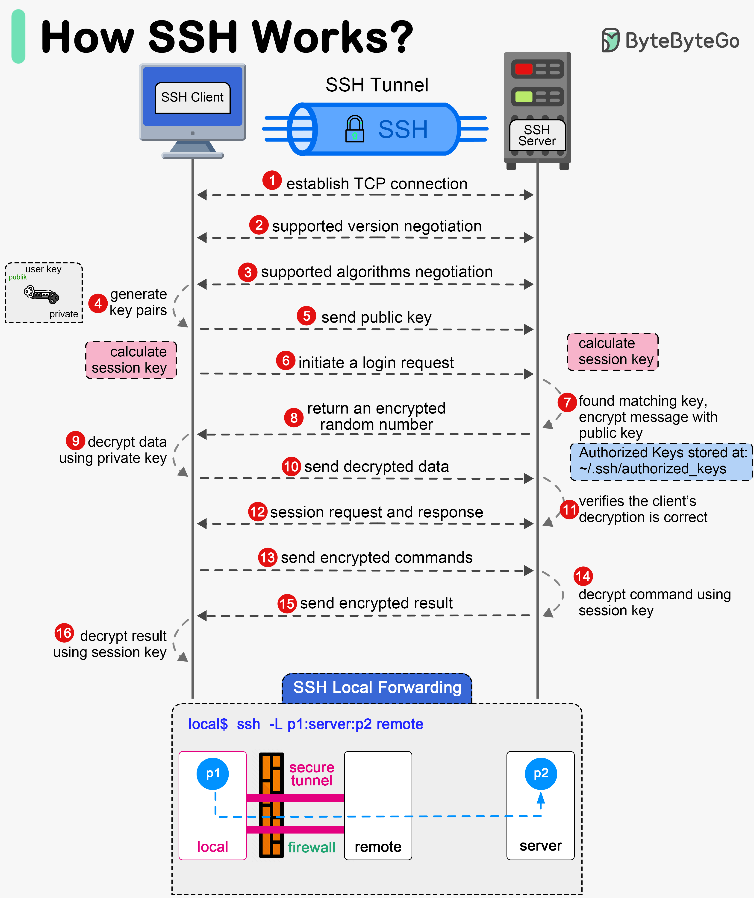

# 3회차 학습 정리 — 인스턴스 생성부터 SSH 접속까지

> 세션: 9/14(월) 22:00  
> 이번에 지급받는 가비아 VM에 SSH로 접속하고, 서버 상태를 확인한다. VM이 준비되는 내부 과정은 OpenStack의 서비스와 연결해서 이해한다.

## 1. 내가 접속할 VM은 어떻게 만들어졌을까

### 1-1. 지금 받는 VM과 앞으로 만들 VM

이번 주에는 스터디장이 가비아에서 생성한 VM을 1인 1대씩 지급받는다. 공인 IP, 개인키 파일, 계정명은 개별 DM으로 전달받고, 나는 준비된 VM에 접속해 상태를 확인한다.

6회차에는 그 VM 위에 배포한 OpenStack에서 직접 인스턴스를 만들게 된다. 즉, 지금은 클라우드 사용자 입장에서 결과를 받고, 이후에는 운영자 입장에서 생성 과정을 관찰하는 것이다.

가비아 내부 구현이 OpenStack과 같다고 단정할 수는 없다. 다만 사용자의 요청을 받고, 자원을 배치하고, 디스크와 네트워크를 준비해 VM을 실행한다는 큰 흐름은 연결해서 생각할 수 있다.

### 1-2. 인스턴스 생성 요청의 6단계

2회차의 component들을 하나의 요청으로 연결하면 다음과 같다.

```text
Horizon / CLI
  → 1. Keystone: 인증과 token 발급
  → 2. nova-api: 요청 검증과 생성 접수
  → 3. nova-conductor / nova-scheduler / Placement: host 선택
  → 4. RabbitMQ → nova-compute: 선택된 host에 build 작업 전달
  → 5. Glance / Neutron / Cinder: image·port·disk 준비
  → 6. libvirt → QEMU/KVM: VM 실행
```

| 단계 | 담당 | 실제로 하는 일 |
| --- | --- | --- |
| 1. 인증 | Keystone | credential과 scope를 확인하고 token을 발급한다. 이미 유효한 token이 있다면 재사용할 수 있다. |
| 2. 접수 | nova-api | token 검증, policy·quota·요청 형식 확인 후 초기 instance 상태를 기록한다. |
| 3. 배치 | Conductor·Scheduler·Placement | 자원 조건을 만족하는 host 후보를 찾고 Filter·Weigher로 실행 위치를 결정한다. |
| 4. 전달 | RabbitMQ·nova-compute | 선택된 compute host가 RPC로 build 작업을 전달받는다. |
| 5. 준비 | nova-compute와 다른 서비스 | image와 disk를 준비하고 Neutron port를 연결한다. 필요하다면 Cinder volume도 연결한다. |
| 6. 기동 | libvirt·QEMU/KVM | VM의 disk·vNIC 등을 구성하고 실제 guest process를 실행한다. |

이것은 학습용 대표 경로다. Port를 언제 생성하는지, image를 내려받는지, volume으로 부팅하는지는 요청과 backend에 따라 달라진다. Nova는 전체 작업을 조정하지만 image는 Glance, port와 IP는 Neutron, volume은 Cinder가 소유한다.

Nova의 API·Scheduler·Conductor·Compute 역할과 내부 RPC 구조는 [Nova 2026.1 System Architecture](https://docs.openstack.org/nova/2026.1/admin/architecture.html), host 후보 선별은 [Nova 2026.1 Scheduling](https://docs.openstack.org/nova/2026.1/reference/scheduling.html)에서 확인할 수 있다.

### 1-3. 시간이 걸리는 곳은 어디일까

1에서 4단계는 주로 인증, 상태 기록, 자원 선택, 메시지 전달이다. 반면 5~6단계는 실제 image download, disk 생성, network 연결, hypervisor 기동을 수행한다. 그래서 뒤쪽이 수십 초 이상 걸릴 수 있다. 이 시간은 고정된 규칙이 아니라 환경에 따라 달라지는 경향으로 이해하면 된다.

같은 compute host에서 같은 image를 다시 사용하면 base image cache를 재사용해 빨라질 수 있다. 하지만 다른 host에 배치됐거나 cache가 지워졌다면 다시 준비해야 한다. 공유 storage에서는 image 준비 방식 자체가 달라질 수도 있다. [Nova 2026.1 Image Caching](https://docs.openstack.org/nova/2026.1/admin/image-caching.html)

#### 질문 (필수)

6단계 중 시간이 실제로 걸리는 구간은 어디고, 왜 그런가요?

**내 답:** 5,6단계에서 시간이 많이 걸리는 것으로 이해했다. 앞의 1~4단계는 주로 인증, DB 기록, host 선택, 작업 전달인데, 5,6단계는 image를 내려받고 disk와 network를 준비한 뒤 실제 VM process를 실행한다. 즉, 결정만 하는 단계보다 network·storage I/O와 hypervisor 기동이 들어가는 단계가 더 오래 걸리는 것이다. 같은 host에 image cache가 있으면 준비 시간이 줄어들 수도 있다.

---

## 2. 화면에 보이는 상태와 실제 준비 상태는 다르다

### 2-1. BUILD → ACTIVE는 무엇을 뜻할까

nova-api가 생성 요청을 접수하면 실제 VM이 실행되기 전에도 대시보드에 instance가 나타날 수 있다. 화면은 hypervisor process 자체가 아니라 Control Plane에 기록된 상태를 보여주기 때문이다.

```text
생성 접수
  → BUILD: scheduling
  → BUILD: network·disk 준비
  → BUILD: spawning
  → ACTIVE

생성 중 실패
  → ERROR
```

위 흐름은 개념도다. 실제 task_state 문자열은 Nova 버전과 작업 경로에 따라 달라질 수 있다.

| 확인 대상 | 의미 |
| --- | --- |
| API의 status | BUILD·ACTIVE·ERROR처럼 사용자에게 보이는 상태 |
| vm_state | building·active 등 instance의 생명주기 상태 |
| task_state | scheduling·spawning 등 현재 진행 중인 일시적 작업 |
| power_state | hypervisor가 보고한 실제 전원 상태 |

상태를 나누어 보는 이유는 “Nova가 어떤 상태로 기록했는가”, “지금 무슨 작업을 하는가”, “실제로 실행 중인가”가 서로 다른 질문이기 때문이다. [Nova 2026.1 VM States and Transitions](https://docs.openstack.org/nova/2026.1/reference/vm-states.html)

### 2-2. API 성공, ACTIVE, SSH 성공은 별개다

```text
API 요청 접수 성공
  ≠ VM 생성 작업 완료
  ≠ guest 초기화 완료
  ≠ SSH 접속 가능
```

VM 생성 API가 요청을 받아들였더라도 이후 image 준비나 host 배치에 실패하면 ERROR가 될 수 있다. ACTIVE가 되어도 guest OS, IP 설정, 공개키 배치, SSH service, network 접근 규칙까지 준비되어야 실제 접속이 된다. [Compute API Faults](https://docs.openstack.org/api-guide/compute/faults.html)

예를 들어 QEMU는 실행됐지만 guest의 공개키 설정이 아직 끝나지 않았다면, VM은 ACTIVE인데 SSH 키 인증은 실패할 수 있다. 그래서 “ACTIVE니까 문제없다”보다 “VM 실행 다음에 무엇이 남아 있지?”라고 생각하는 것이 좋다.

#### 질문 (필수)

인스턴스가 대시보드에 보이는 시점과 실제로 존재하는 시점은 왜 다른가요? (몇 단계와 몇 단계 사이?)

**내 답:** 2단계에서 nova-api가 생성 요청을 접수하고 DB에 instance 상태를 기록하기 때문에, 아직 VM이 실행되지 않았어도 대시보드에는 보일 수 있다. 실제 VM process가 실행되는 것은 준비물을 모은 뒤의 6단계다. 즉, 2단계의 생성 기록과 6단계의 실제 기동 사이에 차이가 있는 것이다. 화면에 instance가 보인다고 생성이 끝난 것은 아니고, 중간 작업에 실패하면 ERROR가 될 수도 있다.

### 2-3. ERROR를 생성 단계로 연결하기

`No valid host was found`는 3단계의 host 배치에서 적절한 실행 위치를 찾지 못했다는 신호다. 메모리·vCPU·disk 부족뿐 아니라 trait, aggregate, compute service 상태, Placement inventory와 allocation도 확인 대상이다. “무조건 메모리 부족”이나 “물리 server가 고장났다”로 단정하면 확인 범위를 놓칠 수 있다. [Nova 2026.1 Scheduling](https://docs.openstack.org/nova/2026.1/reference/scheduling.html)

7회차에 log를 추적할 때는 instance UUID, 시간, request ID를 함께 연결한다. 서비스마다 local request ID는 다를 수 있고, global request ID가 전달된 경우 공통 식별자로 사용할 수 있다. 모든 서비스에 무조건 같은 ID가 찍힌다고 가정하지 않는다. [Compute API — Request ID](https://docs.openstack.org/api-guide/compute/faults.html#tracking-errors-by-request-id)

#### 질문 (선택)

No valid host was found는 6단계 중 어디서 나는 에러이고, 무엇을 확인해야 하나요?

**내 답:** 3단계의 배치 결정에서 VM을 실행할 적절한 host를 찾지 못했을 때 나는 에러다. 먼저 요청한 flavor의 vCPU·memory·disk 조건을 만족하는 host가 있는지 확인할 것 같다. 자원이 남아 있어도 compute service가 비활성화됐거나 필요한 trait·aggregate 조건이 맞지 않을 수 있으므로, Scheduler와 Placement 상태도 같이 봐야 한다. 즉, 단순히 “서버가 고장났다”가 아니라 “이번 요청을 배치할 수 있는 자리가 왜 없지?”라는 관점으로 확인하는 것이다.

---

## 3. 첫 부팅에서 내 공개키는 어떻게 들어갈까

### 3-1. cloud-init은 guest 안에서 실행된다

**cloud-init**은 클라우드 VM이 부팅될 때 플랫폼이 전달한 정보로 OS의 초기 설정을 해 주는 도구다. Ubuntu 같은 cloud image에 미리 포함되는 경우가 많고, VM 바깥의 관리 서비스가 아니라 guest OS 안에서 실행된다.

즉, Nova·hypervisor가 VM을 실행한다면 cloud-init은 그 VM 안에서 사용할 환경을 준비하는 역할이라고 이해하면 된다. VM process가 실행되는 것과 로그인 계정·공개키 등의 설정이 준비되는 것은 서로 다른 단계다.

주요 작업은 다음과 같다.

- 사용자 계정과 SSH 공개키 설정
- hostname과 network 설정
- root partition·filesystem 확장
- user-data로 지정한 초기 설정과 script 실행

Image와 설정에 따라 수행 항목은 달라지고, 모든 작업이 매 부팅마다 반복되는 것도 아니다. [cloud-init Introduction](https://docs.cloud-init.io/en/latest/explanation/introduction.html)

스터디장이 생성 요청에 공개키를 등록하면, 플랫폼이 그 정보를 제공하고 guest의 초기화 도구가 `~/.ssh/authorized_keys`에 반영할 수 있다. 개인키를 VM에 보내는 것이 아니라 **공개키만 전달하는 것**이다.

Ubuntu 계정으로 접속하는 예를 들면 다음과 같다. 아래는 설정 흐름의 예시이며, 실제 실행 기록은 5-5에 따로 남겼다.

```text
생성 요청에 SSH 공개키 지정
  → VM 부팅과 cloud-init 실행
  → 플랫폼이 제공한 metadata에서 공개키 읽기
  → ubuntu 계정의 ~/.ssh/authorized_keys에 등록
  → 해당 개인키를 가진 사용자가 SSH 키 인증 가능
```

Network와 SSH service도 준비되어야 실제 접속이 된다. cloud-init은 공개키뿐 아니라 user-data에 지정된 package 설치나 초기 script도 처리할 수 있으며, 실제 작업은 image와 설정에 따라 달라진다. [cloud-init 공식 소개](https://docs.cloud-init.io/en/latest/explanation/introduction.html)

### 3-2. 메타데이터 서비스는 VM의 설정 정보 창구다

**Metadata**는 instance ID, hostname, 공개키, network 설정처럼 VM이 자기 초기화에 사용할 정보다. **User-data**는 사용자가 전달한 초기 설정이나 script다. OpenStack에서는 Metadata Service를 통해 이 정보를 guest에 제공할 수 있다. [Nova 2026.1 Metadata](https://docs.openstack.org/nova/2026.1/user/metadata.html)

대표적인 Metadata Service 주소는 `http://169.254.169.254`다. 이것은 내 노트북에서 여는 공용 관리 페이지가 아니라, guest VM이 자기 정보를 가져오는 endpoint다.

```text
사용자가 생성 요청에 공개키·user-data 등을 지정
  → 플랫폼이 VM별 metadata를 제공
  → guest 첫 부팅과 cloud-init 실행
  → datasource에서 설정 정보 읽기
  → 사용자 계정·authorized_keys·hostname 등 적용
  → network와 SSH service가 준비되면 접속 가능
```

OpenStack의 ML2/OVS 구성에서는 Neutron의 metadata proxy/agent 경로가 guest 요청을 Nova Metadata API로 중계한다. Nova가 instance별 정보를 제공한다는 점과 Neutron이 접근 경로를 지원한다는 점을 나누어 이해하면 된다. 이 요청은 link-local 주소를 위한 별도 network 경로로 처리되며, 단순히 hypervisor가 언제나 직접 가로채는 구조라고 단정하지 않는다. [Nova 2026.1 Metadata Service](https://docs.openstack.org/nova/2026.1/admin/metadata-service.html)

가비아의 실제 datasource와 metadata 경로는 지급된 환경을 확인해야 한다. AWS를 포함한 다른 cloud도 유사한 역할을 제공하지만, 인증 방식과 주소 사용 절차까지 모두 같지는 않다.

### 3-3. cloud-init은 어떤 순서로 실행될까

cloud-init은 하나의 script를 한 번 실행하고 끝내는 것이 아니라, 부팅 과정에서 여러 단계로 나누어 설정을 적용한다.

| 단계 | 하는 일 |
| --- | --- |
| Detect | 어떤 cloud 환경인지 감지하고 cloud-init 실행 여부를 판단한다. |
| Local | datasource를 찾고 초기 network 설정을 준비한다. |
| Network | 설정된 network가 올라온 뒤 user-data를 처리하고 초기 module을 실행한다. |
| Config | 나머지 설정 module을 실행한다. |
| Final | package 설치, 설정 관리 도구, 사용자 초기 script 등 마지막 작업을 수행한다. |

여기서 **SSH 접속이 가능해도 cloud-init의 마지막 작업은 진행 중일 수 있다.** 예를 들어 계정과 공개키가 준비돼 SSH로 들어갔더라도, user-data로 요청한 package 설치는 Final 단계에서 계속 실행 중일 수 있다. 즉, SSH 접속 성공과 초기화 전체 완료를 같은 것으로 보면 안 된다. [cloud-init Boot Stages](https://docs.cloud-init.io/en/latest/explanation/boot.html)

### 3-4. 재부팅하면 초기 설정도 다시 실행될까

cloud-init은 기본적으로 현재 instance ID와 저장된 상태를 비교해 새 instance의 첫 부팅인지, 같은 VM의 재부팅인지 판단한다. 작업도 instance당 한 번 실행하는 **per-instance**와 매 부팅마다 실행하는 **per-boot** 등으로 구분한다.

예를 들어 같은 VM을 재부팅했다고 해서 한 번만 실행하도록 설정된 초기 script와 공개키 설정 과정이 모두 처음부터 반복되는 것은 아니다. 반면 매 부팅 실행하도록 설정된 작업은 다시 실행될 수 있다. 실제 반복 여부는 각 module과 script의 실행 주기에 따라 달라진다.

즉, “cloud-init은 부팅할 때 동작한다”와 “모든 초기 설정을 매번 다시 적용한다”는 다른 말이다. 새 image로 VM을 다시 생성한 경우도 단순 재부팅과 구분해야 한다. [cloud-init First Boot Determination](https://docs.cloud-init.io/en/latest/explanation/first_boot.html)

#### 질문 (선택)

ACTIVE 상태인데 SSH가 안 되는 인스턴스가 있다면, cloud-init/메타데이터 관점에서 어떤 가설을 세울 수 있나요?

**내 답:** VM process는 실행됐지만 guest 안의 초기 설정이 아직 끝나지 않았을 수 있다고 생각했다. 예를 들어 cloud-init이 metadata에 접근하지 못해 공개키를 받지 못했거나, 잘못된 공개키·계정 설정이 적용돼 authorized_keys가 기대한 상태가 아닐 수 있다. 그래서 console에서 부팅 과정과 cloud-init 오류, metadata 접근 경로, 해당 계정의 공개키 설정을 확인할 것 같다. ACTIVE만으로 SSH 준비가 끝났다고 보지는 않고, network와 SSH service 문제도 따로 구분해야 한다.

---

## 4. SSH는 무엇을 확인하고 접속할까

### 4-1. 암호화된 원격 터미널

**SSH(Secure Shell)**는 원격 server와 암호화된 통신을 하고 shell을 사용할 수 있게 하는 protocol이다. 기본 TCP port는 22이며, 사용자 인증에는 비밀번호나 공개키 방식을 사용할 수 있다. 이번 실습은 지급받은 개인키로 인증한다. [OpenSSH ssh 매뉴얼](https://man.openbsd.org/ssh.1)



*그림 1. ByteByteGo의 SSH 흐름 그림. TCP 연결, 암호화 통신, 키 인증, 원격 명령 실행의 큰 흐름을 보는 용도다. 다만 그림의 “서버가 난수를 공개키로 암호화하고 client가 복호화”하는 설명은 실제 SSH 공개키 인증과 다르다. 실제 방식은 아래처럼 개인키로 만든 서명을 공개키로 검증한다. 하단 Local Forwarding은 이번 접속 실습의 필수 범위는 아니다.*

### 4-2. 공개키는 server, 개인키는 내 computer

| 키 | 보관 위치 | 역할 |
| --- | --- | --- |
| 사용자 공개키 | VM 계정의 `~/.ssh/authorized_keys` | 이 계정에 로그인하도록 허용한 키 |
| 사용자 개인키 | 내 computer의 key file | 내가 해당 공개키의 주인임을 서명으로 증명 |

공개키를 “자물쇠”, 개인키를 “열쇠”라고 생각하면 보관 위치를 기억하기 쉽다. 실제 인증에서는 client가 개인키로 서명하고, server는 허용된 공개키와 서명의 유효성을 확인한다. 개인키 자체는 server에 보내지 않는다. [RFC 4252 — Public Key Authentication](https://datatracker.ietf.org/doc/html/rfc4252#section-7)

```text
내 computer: 개인키로 로그인 요청에 서명
  → VM: 해당 계정에서 허용된 공개키인지 확인
  → VM: 공개키로 서명 검증
  → 두 검사가 성공하면 사용자 인증 통과
```

개인키는 비밀번호처럼 보호해야 한다. 단톡방, screenshot, Git에 올리지 않고 다른 사람에게 전달하지 않는다. `.pem`은 이번에 받은 파일의 확장자일 뿐, 모든 SSH 개인키의 이름이 반드시 `.pem`인 것은 아니다. [Microsoft — SSH Key Pairs](https://learn.microsoft.com/en-us/windows-server/administration/openssh/openssh_keymanagement#key-pairs)

원문 안내상 지원용 스터디장 공개키도 VM에 등록되어 있다. 등록된 공개키 하나는 해당 계정으로 로그인할 수 있는 권한이다. 지원용 키 제거 여부는 지원 방식과 함께 판단하고, 내 접속 키나 계정을 잘못 지우지 않도록 한다.

#### 질문 (필수)

개인키와 공개키 중 서버에 저장되는 것은? 절대 남에게 전달하면 안 되는 것은?

**내 답:** 서버에는 공개키가 해당 계정의 `~/.ssh/authorized_keys`에 저장된다. 개인키는 내 computer에 보관하고, 접속할 때 해당 공개키의 주인이라는 것을 서명으로 증명하는 데 사용한다. 즉, 절대 다른 사람에게 전달하면 안 되는 것은 개인키다. 이번에는 `10th-openstack.pem`을 `ssh -i`로 지정해 접속했고, 개인키 파일의 내용 자체를 서버에 보낸 것은 아니다.

### 4-3. known_hosts는 server가 맞는지 확인한다

사용자 키는 “내가 누구인지” 증명하고, **server host key**는 “접속한 server가 누구인지” 증명한다. 두 키는 목적이 다르다.

첫 접속에서는 server 공개 host key의 fingerprint가 표시된다. 스터디장에게 신뢰할 수 있는 경로로 전달받은 fingerprint와 비교한 뒤 일치할 때 `yes`를 입력한다. `~/.ssh/known_hosts`에는 server의 공개 host key와 식별 정보가 저장되고, 이후 같은 목적지의 키가 달라지면 경고한다. 단순히 fingerprint 문자열만 저장되는 것은 아니다. [OpenSSH — Host Key Checking](https://man.openbsd.org/ssh.1)

---

## 5. 지급받은 VM에 접속하고 상태 확인하기

### 5-1. 접속 전 준비 — 내 computer

아래 명령의 `mykey.pem`, `VM_PUBLIC_IP`, `ubuntu`는 **개별 DM의 실제 파일명·공인 IP·계정명으로 바꾼다**. 다운로드 위치가 다르면 key file 경로도 바꾼다. 이번 단계는 원격 VM이 아니라 내 computer에서 실행한다.

**macOS / Linux 터미널**

```bash
# 개인키 파일이 있는지 확인
ls -l ~/Downloads/mykey.pem

# 소유자만 읽고 쓸 수 있도록 제한
chmod 600 ~/Downloads/mykey.pem

# 지급받은 VM으로 접속
ssh -i ~/Downloads/mykey.pem ubuntu@VM_PUBLIC_IP
```

`-i`는 사용할 개인키 경로를 지정한다. `600`은 소유자에게만 읽기·쓰기 권한을 주는 설정이다. 다른 사용자가 개인키를 읽을 수 있으면 SSH가 사용을 거부할 수 있다. [OpenSSH — Identity File Permissions](https://man.openbsd.org/sshd.8)

**Windows PowerShell**

```powershell
# OpenSSH client가 있는지 확인
ssh -V

# 개인키 파일이 있는지 확인
Get-Item "$env:USERPROFILE/Downloads/mykey.pem"

# 지급받은 VM으로 접속
ssh -i "$env:USERPROFILE/Downloads/mykey.pem" ubuntu@VM_PUBLIC_IP
```

Windows는 `chmod` 대신 파일의 보안 권한(ACL)을 사용한다. 개인키 권한 오류가 나면 다른 사용자의 읽기 권한과 소유자를 확인한다. macOS/Linux 명령을 그대로 PowerShell에서 실행하지 않는다.

### 5-2. 첫 접속의 server fingerprint 확인

다음과 비슷한 질문이 표시될 수 있다.

```text
The authenticity of host '...' can't be established.
ED25519 key fingerprint is SHA256:...
Are you sure you want to continue connecting (yes/no/[fingerprint])?
```

처음 보는 키라는 뜻이지, 이 메시지 자체가 장애는 아니다. 전달받은 server fingerprint와 비교해서 확인한 뒤 `yes`를 입력한다. Fingerprint를 전달받지 않았다면 먼저 스터디장에게 확인한다.

접속 후 `ubuntu@...` 같은 원격 shell prompt가 나타나면 다음 단계의 명령은 **VM 안에서** 실행한다.

### 5-3. 서버 검증 — SSH로 접속한 VM 내부

```bash
# OS와 버전: 안내받은 Ubuntu 24.04인지 확인
lsb_release -a

# 현재 process에서 사용할 수 있는 CPU 수
nproc

# 전체·사용·가용 memory
free -h

# root filesystem의 크기와 여유 공간
df -h /

# CPU 가상화 기능이 guest에 노출되는지 확인
grep -Ec '(vmx|svm)' /proc/cpuinfo

# network interface와 IP
ip -br addr

# 기본 gateway와 routing table
ip route
```

| 확인 항목 | 어떻게 읽을까 |
| --- | --- |
| OS | 지급 안내와 배포판·버전이 일치하는지 본다. |
| CPU | `nproc` 결과를 지급된 vCPU 사양과 비교한다. |
| Memory | `free -h`의 total과 available을 본다. 일부 memory는 OS가 사용하므로 total 전체가 free일 필요는 없다. |
| Disk | `df -h /`의 Size·Avail·Use%로 root filesystem 상태를 본다. 전체 block device 용량과는 다를 수 있다. |
| Network | VM 내부 IP가 DM의 공인 IP와 다르더라도 NAT 구성에서는 정상일 수 있다. |
| Virtualization | flag가 노출됐는지 먼저 보고, KVM 장치와 설정을 추가로 확인한다. |

직접 실행한 명령과 실제 출력은 5-5에 기록했다. 아래의 추가 확인 명령과 실제 수행 기록은 구분해서 본다.

### 5-4. 중첩 가상화는 flag 하나로 확정하지 않는다

`vmx`는 Intel, `svm`은 AMD의 CPU 가상화 기능이다. 앞 명령의 결과가 1 이상이면 관련 flag가 노출되어 있다는 뜻이고, 곧바로 KVM 사용 가능을 확정하는 값은 아니다.

같은 VM에서 장치도 확인한다.

```bash
# KVM 장치의 존재와 접근 권한 확인
if test -c /dev/kvm; then
  ls -l /dev/kvm
else
  echo "/dev/kvm 장치 없음: KVM 사용 조건을 추가 확인해야 함"
fi
```

KVM을 사용하려면 바깥 hypervisor의 nested virtualization 지원, `/dev/kvm` 접근 권한, 이후 Nova/libvirt container의 장치 접근과 `virt_type` 설정도 맞아야 한다. KVM API는 `/dev/kvm` 장치로 접근한다. [Linux Kernel — KVM API](https://docs.kernel.org/virt/kvm/api.html)

따라서 결과가 0이거나 장치가 없으면 하드웨어 가속 조건을 의심한다. QEMU software emulation을 선택하는 구성에서는 안쪽 VM이 더 느리게 부팅할 수 있지만, 지금 외부 가비아 VM에 SSH로 접속하는 것까지 불가능해지는 것은 아니다.

### 5-5. 직접 진행한 실습과 실제 출력

내 computer의 `members/정장우` 폴더에서 지급받은 `10th-openstack.pem`으로 접속했다. 로그인 후 prompt가 `ubuntu@vm-8:~$`로 바뀌었고, 그 상태에서 OS·CPU·memory·disk·가상화 flag·network를 확인했다.

아래는 직접 진행한 터미널 기록이다. 로컬 prompt, SSH 로그인 화면, 입력한 명령어와 출력까지 그대로 남겼다. 출력의 `swm` 오타와 로그인 안내 문구도 원문대로 보존했다.

```text
 Jangwoo 🌙   ~/Desktop/Study/10th-openstack-study/members/정장우   main
 ssh -i 10th-openstack.pem ubuntu@1.201.116.168
Welcome to Ubuntu 24.04.4 LTS (GNU/Linux 6.8.0-106-generic x86_64)

 * Documentation:  https://help.ubuntu.com
 * Management:     https://landscape.canonical.com
 * Support:        https://ubuntu.com/pro

 System information as of Sun Sep 13 14:37:19 KST 2026

  System load:  0.0               Processes:             110
  Usage of /:   4.5% of 47.39GB   Users logged in:       0
  Memory usage: 4%                IPv4 address for eth0: 192.168.0.109
  Swap usage:   0%

 * Canonical Workshop gives developers fast, composable, reproducible, and
   secure developer environments that are perfect for agentic workflows.

   https://ubuntu.com/workshop

Expanded Security Maintenance for Applications is not enabled.

43 updates can be applied immediately.
1 of these updates is a standard security update.
To see these additional updates run: apt list --upgradable

Enable ESadditional future security updates.
See https://ubuntu.com/esm or run: sudo pro status


1 updates could not be installed automatically. For more details,
see /var/log/unattended-upgrades/unattended-upgrades.log

*** System restart required ***
Last login: Sat Sep 12 23:20:42 2026 from 211.51.96.127
ubuntu@vm-8:~$ lsb_release -a
No LSB modules are available.
Distributor ID:	Ubuntu
Description:	Ubuntu 24.04.4 LTS
Release:	24.04
Codename:	noble
ubuntu@vm-8:~$ nproc
2
ubuntu@vm-8:~$ free -h
               total        used        free      shared  buff/cache   available
Mem:           7.8Gi       499Mi       6.1Gi       5.1Mi       1.5Gi       7.3Gi
Swap:             0B          0B          0B
ubuntu@vm-8:~$ df -h /
Filesystem      Size  Used Avail Use% Mounted on
/dev/vda1        48G  2.2G   46G   5% /
ubuntu@vm-8:~$ egrep -c '(vmx|swm)' /proc/cpuinfo
4
ubuntu@vm-8:~$ ip a
1: lo: <LOOPBACK,UP,LOWER_UP> mtu 65536 qdisc noqueue state UNKNOWN group default qlen 1000
    link/loopback 00:00:00:00:00:00 brd 00:00:00:00:00:00
    inet 127.0.0.1/8 scope host lo
       valid_lft forever preferred_lft forever
    inet6 ::1/128 scope host noprefixroute
       valid_lft forever preferred_lft forever
2: eth0: <BROADCAST,MULTICAST,UP,LOWER_UP> mtu 1500 qdisc fq_codel state UP group default qlen 1000
    link/ether fa:16:3e:45:72:21 brd ff:ff:ff:ff:ff:ff
    altname enp0s3
    altname ens3
    inet 192.168.0.109/24 metric 100 brd 192.168.0.255 scope global dynamic eth0
       valid_lft 34547sec preferred_lft 34547sec
    inet6 fe80::f816:3eff:fe45:7221/64 scope link
       valid_lft forever preferred_lft forever
```

실제 진행 순서는 `SSH 접속 → OS 확인 → CPU 확인 → memory 확인 → root disk 확인 → 가상화 flag 확인 → network 확인`이었다. 위 코드 블록은 실행할 명령어 예시가 아니라 이미 실행한 결과다.

| 확인 항목 | 실제 결과 | 내가 이해한 내용 |
| --- | --- | --- |
| SSH 접속 | `ubuntu@vm-8:~$` prompt 표시 | 개인키를 지정해 VM에 접속했고, 이후 명령은 VM 안에서 실행했다. |
| OS / kernel | Ubuntu 24.04.4 LTS, noble / 6.8.0-106-generic, x86_64 | 안내받은 Ubuntu 24.04 계열이 맞았다. `No LSB modules are available.`가 나왔지만 배포판 정보는 정상적으로 출력됐다. |
| CPU | `nproc` → `2` | 현재 shell의 process에서 사용할 수 있는 CPU 수는 2였다. |
| Memory | total 7.8Gi, used 499Mi, available 7.3Gi | 접속 당시에는 사용량이 적었고, 약 7.3Gi를 사용할 수 있는 상태였다. |
| Swap | total·used·free 모두 0B | 이 출력 기준으로 활성화된 swap은 없었다. |
| Root disk | `/dev/vda1`, Size 48G, Used 2.2G, Avail 46G, Use 5% | root filesystem에 약 46G의 여유 공간이 있었다. |
| 가상화 관련 검색 | `egrep -c '(vmx\|swm)'` → `4` | 입력한 패턴과 일치하는 줄이 4개였다. CPU 4개라는 뜻이나 KVM 사용 확정 결과는 아니다. |
| Network | `eth0` UP, `192.168.0.109/24`, MTU 1500 | VM 안에서는 사설 IPv4 주소를 사용하고 있었다. 공인 IP와 내부 IP가 다르므로 외부 주소가 VM으로 연결되는 구성이 있음을 알 수 있고, 구체적인 NAT 경로는 이 출력만으로 확정하지 않는다. |

로그인 화면의 memory 4%와 `free -h`의 수치는 표시 시점과 계산 방식이 달라 완전히 같은 값일 필요는 없다. Disk도 로그인 화면은 GB 단위로, `df -h`는 다른 단위와 반올림 방식으로 표시하므로 47.39GB와 48G를 곧바로 사양 불일치로 판단하지 않는다.

가상화 확인에서는 AMD flag를 `swm`으로 입력했는데, 올바른 표기는 `svm`이다. 원문 결과는 수정하지 않고, 재확인할 명령만 따로 적어 둔다.

```bash
# 재확인용 명령: 아래 명령의 실제 출력은 아직 이 기록에 없음
grep -Ec '(vmx|svm)' /proc/cpuinfo

# KVM 장치 존재와 접근 권한도 별도로 확인
ls -l /dev/kvm
```

실제 로그에는 `/dev/kvm`, `ip route` 결과가 없으므로 이 항목들은 아직 확인 결과를 적지 않았다. SSH 접속은 성공했지만, 그 사실만으로 cloud-init 전체 완료나 중첩 KVM 사용 가능까지 확정할 수는 없다.

또한 로그인 화면에는 적용 가능한 update 43개, 자동 설치되지 못한 update 1개, `System restart required` 안내가 있었다. 이 로그는 안내를 확인한 기록이며, update 설치나 재부팅을 수행했다는 기록은 아니다.

### 5-6. 실습 인증과 접속 종료

원문 과제는 SSH 접속 성공 화면과 서버 검증 결과가 보이는 screenshot을 단톡방에 올리는 것이다. 위 기록에는 개인키 파일명만 있고 개인키 내용은 없다. 다만 공인 IP, 이전 접속 IP, MAC 주소, 로컬 경로도 포함되어 있으므로 공개 저장소에 올리기 전에는 그대로 공개할지 확인한다.

아래 `exit`은 종료 방법이며, 제공한 실습 로그에는 실제 실행 결과가 포함되지 않았다.

```bash
exit
```

`exit`은 SSH session을 끝내는 명령이지 VM을 종료하는 명령이 아니다.

---

## 6. SSH 오류는 어느 단계에서 났을까

### 6-1. 연결 문제와 인증 문제 나누기

SSH 접속은 대략 TCP 연결, server 신원 확인, 사용자 인증, shell 실행을 거친다. 어떤 메시지가 나왔는지 보면 다음에 확인할 대상을 좁힐 수 있다.

| 메시지 | 먼저 세울 가설 | 확인 대상 |
| --- | --- | --- |
| `Connection timed out` | TCP 연결이 완료되지 않음 | 공인 IP·port·network 경로·방화벽과 server 상태 |
| `Connection refused` | 연결 시도에 명시적인 거절 응답이 옴 | SSH listener, 잘못된 port, firewall reject, 부팅 상태 |
| `Permission denied (publickey)` | 키 인증이 통과하지 못함 | 계정명, 개인키 경로, server의 authorized_keys, cloud-init |
| `UNPROTECTED PRIVATE KEY FILE` | 로컬 개인키 접근 권한이 너무 넓음 | macOS/Linux의 chmod, Windows의 파일 권한 |
| `REMOTE HOST IDENTIFICATION HAS CHANGED!` | 저장된 server host key와 현재 키가 다름 | VM 재발급 여부, 실제 server fingerprint, 접속 대상 |

`timed out`을 방화벽 문제로만, `refused`를 sshd 문제로만 단정하지 않는다. 다만 전자는 연결 경로부터, 후자는 접속 port의 listener와 거절 정책부터 보는 것이 합리적이다.

#### 질문 (필수)

Connection timed out과 Connection refused는 각각 무엇이 문제라는 신호인가요?

**내 답:** timed out은 TCP 연결이 끝까지 이루어지지 않았다는 신호라서 IP, network 경로, 방화벽 차단, 서버 상태부터 확인할 것 같다. refused는 연결 시도에 거절 응답이 왔다는 뜻이므로 잘못된 port, SSH service가 듣고 있는지, firewall reject 여부를 먼저 확인해야 한다. 쉽게 말하면 전자는 응답을 받지 못한 쪽이고, 후자는 명시적으로 거절당한 쪽이다. 다만 이것만으로 원인을 방화벽이나 sshd 하나로 확정할 수는 없다.

### 6-2. 재발급된 VM의 host key가 달라졌다면

같은 IP라도 VM을 새로 만들면 host key가 달라질 수 있다. 하지만 중간자 공격이나 잘못된 server 접속도 같은 경고를 만들 수 있으므로, 경고를 무조건 지우고 넘어가면 안 된다.

1. 스터디장에게 VM 재발급 여부와 새로운 fingerprint를 확인한다.
2. 확인된 대상의 옛 기록만 제거한다.
3. 다시 접속하고 새로운 fingerprint를 비교한다.

**내 computer의 터미널 또는 PowerShell**

```bash
# VM_PUBLIC_IP는 확인된 실제 공인 IP로 바꾼다.
# known_hosts의 해당 목적지 기록만 제거한다.
ssh-keygen -R VM_PUBLIC_IP

# 지급된 개인키로 다시 접속하고 fingerprint를 확인한다.
ssh -i ~/Downloads/mykey.pem ubuntu@VM_PUBLIC_IP
```

재접속 명령은 macOS/Linux 경로 예시다. Windows에서는 5-1의 PowerShell 경로를 사용한다. `ssh-keygen -R`은 VM의 키를 바꾸는 것이 아니라 내 computer의 known_hosts 기록을 제거한다. [OpenSSH ssh-keygen — -R](https://man.openbsd.org/ssh-keygen.1)

#### 질문 (선택)

VM을 재발급받은 뒤 REMOTE HOST IDENTIFICATION HAS CHANGED!가 뜨는 이유와 해결 명령은?

**내 답:** 같은 IP로 새 VM을 받았더라도 server의 host key는 새로 생성될 수 있어서, 내 computer의 known_hosts에 남아 있는 예전 키와 달라 경고가 뜨는 것이다. 다만 잘못된 server에 접속했거나 중간자 공격인 경우에도 같은 경고가 날 수 있으므로, 먼저 스터디장에게 재발급 여부와 새 fingerprint를 확인해야 한다. 정상적인 변경이 맞다면 `ssh-keygen -R 실제_공인_IP`로 해당 목적지의 옛 기록만 지우고 다시 접속해서 새 fingerprint를 비교한다. 이 명령은 VM의 키를 바꾸는 것이 아니라 내 computer의 접속 대상 기록을 정리하는 것이다.
